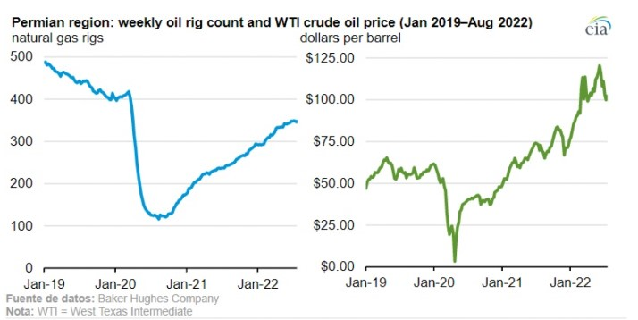

# La influencia del gas ruso en la economia mundial

**Autores**
 Aruani, Juan^[juan.aruani.99@gmail.com]
- Herrera, Lisandro^[herreralisandro.uncu@gmail.com]
- López, Emilia^[emilia.lop49@gmail.com]

## Abstract

La producción de petróleo crudo de EEUU ha aumentado significativamente durante los últimos 10 años, impulsada principalmente por la producción de formaciones rocosas estrechas desarrolladas mediante perforación horizontal y fracturación hidráulica (fracking) para extraer hidrocarburos. A principios del 2019, el fracking posicionó a Estados Unidos como el mayor productor mundial de petróleo, incluso por encima de los grandes productores como Rusia y Arabia Saudí. En aquel año, Donald Trump, en ese entonces presidente del país americano, señalaba que Estados Unidos había logrado independencia energética y que además había logrado controlar el mercado energético.
El problema comenzó cuando a finales de aquel año, el COVID-19 significó un problema generalizado en las economías del mundo y afectó, entre tantas cosas, al mercado del petróleo. La caída del precio del petróleo marcó un récord histórico. Esto llevó a los productores de petróleo y gas a cancelar contratos y obligar a los proveedores a abandonar sus bombas gigantes y sus depósitos de productos químicos. Aproximadamente 31 empresas de fractura hidráulica, lo que representa el 11% de las que operaban a principios del 2020, se desvincularon de la actividad durante la última semana de Marzo, y más del 40% de las 421 que operaron durante el 2019 quedaron olvidadas.
En Estados Unidos, a comienzos del año, en febrero de 2020 realizó cerca de 7300 perforaciones que finalmente se abandonaron, una comparativa que resulta preocupante si se observa que el mes anterior solo dejaron de hacerlo alrededor de 80 perforaciones. 

## Contingencia post COVID-19

La extracción de crudo y gas alcanzó los niveles previos a la pandemia recién en enero de 2022. El 9 de septiembre, Baker Hughes informó que 166 plataformas de gas natural estaban operando en los Estados Unidos, 54 más que al comienzo de la pandemia en los Estados Unidos.

La mayor parte del crecimiento de las plataformas dirigidas a gas natural en Estados Unidos se ha producido en la región de Haynesville, que se extiende por Texas y Nuevo México. El número de plataformas en Haynesville aumentó en más del 50 % entre enero de 2020 y agosto de 2022. A pesar de los precios relativamente altos del gas natural, la perforación en Haynesville sigue siendo económica. La productividad de los pozos de Haynesville y su proximidad a las terminales de exportación de gas natural licuado (GNL) de la Costa del Golfo de EEUU y a los principales consumidores industriales de gas natural atraen a los operadores a la región.

La actividad de las plataformas en la región de los Apalaches de Pensilvania y Virginia Occidental está cerca de volver a las 51 plataformas operativas informadas al 31 de enero de 2020; al 29 de julio de 2022, tenía 48 plataformas dirigidas a gas natural. La mejora de la productividad de los pozos, la construcción de tuberías y el aumento de la capacidad de extracción han ayudado a la tendencia a largo plazo del crecimiento de la producción en Appalachia durante los últimos 10 años; sin embargo, los límites de la capacidad de transporte regional pueden haber comenzado a restringir la actividad de perforación en la región.

## La producción de petróleo y sus derivados en la actualidad

Los mayores productores en el mundo (no debe confundirse con los países que tienen las mayores reservas) son Estados Unidos y Arabia Saudita, según datos de mayo de 2022 de perforación de producción de la Administración de Información Energética de Estados Unidos,.

China tiene ahora el 5% del crudo a nivel mundial, casi 5 millones de barriles por día. En el puesto número cuatro está Canadá, 6% de la producción. El puesto número tres Rusia ocupa 11% de la producción mundial, 10,7 millones de barriles cada 24 horas, muy por debajo de lo que consume. Arabia Saudita genera el 11% del petróleo mundial: equivale a casi 10,84 millones de barriles por día.

Estados Unidos produce casi 19 millones de barriles por día, 20% de la producción mundial que no alcanza para satisfacer sus demandas hoy.

## La dependencia del gas y el petróleo ruso

La invasión rusa de Ucrania ha ensombrecido aún más las perspectivas de crecimiento mundial; la economía europea afronta un grave revés, dados sus vínculos comerciales, financieros y de inversión con los países en guerra.

Europa tiene problemas para contener una crisis de energía que pudiera llevar a apagones rotativos, cierres de fábricas y una profunda recesión.
El motivo principal se debe a que Rusia ha cortado los suministros de gas natural barato de los que el continente ha dependido durante años para alimentar fábricas, generar electricidad y calentar hogares. Eso ha forzado a gobiernos europeos a una búsqueda desesperada de nuevos proveedores y de formas para aminorar el impacto cuando el crecimiento económico se desacelera y suben las cuentas de electricidad de los hogares.

La crisis se profundizó cuando la exportadora estatal rusa Gazprom dijo que el principal gasoducto que transporta gas a Alemania seguirá cerrado debido a un derrame. Dice que no puede reparar el problema debido a las sanciones impuestas al país productor como consecuencia del conflicto bélico entre Rusia y Ucrania

### ¿Qué sucede con el petróleo?

La tensión geopolítica y la crisis energética está empujando a Europa a cambiar la lista de proveedores de petróleo y de gas natural. Las empresas europeas se blindan frente a la incertidumbre de la seguridad de suministro provocada por la invasión militar de Rusia sobre Ucrania buscando alternativas, diversificando proveedores, disparando las compras a otros países que consideran más seguros.

La alternativa principal está siendo elevar hasta niveles récord las importaciones de petróleo y de gas especialmente a Estados Unidos en los últimos meses. El gigante americano es desde enero el mayor proveedor de gas para Europa tras desbancar a Argelia y también consiguió en abril colocarse por primera vez como mayor vendedor de petróleo.

El Gobierno de Joe Biden ofreció a Europa sus ventas de crudo y de gas natural licuado (el que se transporta por barco) para reducir su dependencia de los hidrocarburos rusos, y el resultado está siendo un crecimiento desorbitado del suministro transatlántico que la UE está aprovechando en plena crisis energética.

### ¿Cómo afecta esto a América Latina?

Aunque el descenso en la caída de la demanda afectará a todos los productores de petróleo de la región, el impacto se sentirá más en aquellos que tienen una mayor dependencia del crudo: Venezuela, Ecuador y Colombia.
La transición energética también puede afectar a México, Brasil y Argentina, países que no dependen del petróleo, pero en los que éste tiene un peso significativo en la economía.
Brasil se ha convertido en "el gran productor de petróleo de América Latina", con casi tres millones de barriles diarios, cifra similar a la que alcanzaron Venezuela y México "en sus buenos tiempos".

## Argentina en el contexto mundial del desarrollo de hidrocarburos no convencionales fuera de Estados Unidos

En este contexto mundial del shale oil y gas, que no considera a USA, los dos países con mayor desarrollo en exploración y producción son la Argentina y China. En el presente, la Argentina es el país con el mayor desarrollo de shale oil a nivel mundial fuera de USA. Esto es debido a la intervención pública de YPF a partir del 16 de abril de 2012, acción que permitió a la Argentina iniciar proyectos muy ambiciosos para el desarrollo de formaciones geológicas de explotación no convencional en las cuencas Neuquina y Golfo San Jorge.

YPF es la mayor compañía productora de shale oil y gas del país, con una producción de 22.900 bbl/día de petróleo y 67 millones de pies cúbicos/día de gas natural en abril de 2015, a partir de tres sociedades que tiene en la formación Vaca Muerta. La más importante es la que YPF lleva adelante con Chevron en el Bloque Loma Campana / Loma La Lata Norte. También posee una sociedad con Dow Chemical en el área El Orejano, y una tercera y reciente sociedad con la compañía malaya Petronas en el bloque de La Amarga Chica. Todas estas sociedades que YPF desarrolla con sus socios se sitúan en la cuenca Neuquina y más precisamente en la provincia del Neuquén. Por otra parte, YPF ha firmado memorándums de entendimientos con el gigante gasífero ruso Gazprom y con la compañía petrolera china Sinopec.

## Los principales cinco países con potencial de shale gas fuera de Estados Unidos

Entre los países con mayores reservas de Shale Gas técnicamente recuperables en trillones de pies cúbicos (TCF´s) según datos de la EIA/DOE y ARI para 2013, se observa que:

### China

ctualmente totaliza **1.115 TCF´s** de shale gas, la principal formación geológica en cuanto a reservas técnicamente recuperables es Longmaxi, en la cuenca de Sichuan, con 287 TCF´s, seguida muy cerca por Permian, también en Sichuan, con 215 TCF´s. Ambas formaciones totalizan el 45% del total de las reservas técnicamente recuperables de este hidrocarburo en China. Siendo las dos formaciones antes mencionadas las más cuantiosas del continente asiático.

### Argentina

Es el segundo país del mundo con mayores reservas técnicamente recuperables de shale gas fuera de USA con **802 TCF´s**. Entre las formaciones geológicas más importantes se deben destacar Vaca Muerta con 308 TCF´s y Los Molles con 275 TCF´s, ambas formaciones situadas en la cuenca Neuquina, las que representan el 72,7% del total de reservas de shale gas del territorio nacional.

### Argelia

Es el tercer país del mundo con mayores reservas técnicamente recuperables de shale gas fuera de USA. El país africano cuenta con **707 TCF´s** de shale gas. Entre las formaciones geológicas más importantes, se destacan en la cuenca Ghadames / Berkine, Tannesuft con 176 TCF´s y Frasnian con 106 TCF´s, representando el 39,9% del total del país.

### Canadá

Es el cuarto país a nivel mundial con mayores reservas técnicamente recuperables de shale gas fuera de USA. Cuenta con **573 TCF´s** de shale gas. Entre las principales formaciones se destacan Lower Besa River, en la cuenca de Liard, con 158 TCF´s, y en segundo lugar Duvernay, en la región de Easth & West Shale Basin, con 113 TCF´s. Ambas formaciones representan el 47,3% del país.

### México

ste país cuenta con **545 TCF´s** de shale gas técnicamente recuperables. La formación geológica más importante es Eagle Ford Shale en la región de Burgos, dicha formación totaliza 343 TCF´s y representa el 62,9% del total del país.

## Los principales cinco países con potencial de shale gas fuera de Estados Unidos

Entre los países con mayores reservas de Shale Oil técnicamente recuperables en billones de barriles (bbl) según datos de la EIA/DOE y ARI para 2013, se observa que:

### Rusia

En lo que a reservas técnicamente recuperables de shale oil se refiere, Rusia cuenta con un total de 75 billones de bbl, posicionándose así como el principal país a nivel mundial de este hidrocarburo. La principal formación geológica es Bazhenov Central con 57,9 billones de bbl, ubicada en Siberia Central. Esta formación representa el 77,2% del total de shale oil de Rusia, y además representa el 20,2% de las reservas técnicamente recuperables de shale oil del mundo, excluyendo a USA.

### China

El gigante asiático cuenta con 32 billones de bbl de shale oil técnicamente recuperables. Esto posiciona a China como el segundo país del mundo con mayores reservas de shale oil técnicamente recuperables. La principal formación que aloja shale oil es Qingshankou, en el basamento de Songliao, con 11,5 billones de bbl. Qingshankou representa el 35,9% del shale oil técnicamente recuperable de China.

### Argentina

Se posiciona como el tercer país a nivel mundial con mayores reservas técnicamente recuperables de shale oil fuera de USA, con 27 billones de bbl. Vaca Muerta es la principal formación que contiene el mencionado fluido, en la cuenca Neuquina. Vaca Muerta cuenta con 16,2 billones de bbl de shale oil; este potencial representa el 60% del shale oil de la Argentina.

### Libia

Es el principal país africano con reservas técnicamente recuperables de shale oil y cuenta con 27 billones de bbl, posicionándola cuarta a nivel mundial excluyendo a USA. La principal formación geológica que aloja el fluido es Sirte/Rachmat, situada en el basamento de Sirte, y cuenta con 16,2 billones de bbl de shale oil. Este potencial representa el 62,3% del shale oil de Libia.

### Australia

Cuenta con 18 billones de bbl técnicamente recuperables de shale oil. La formación geológica más importante de Australia es Goldwyer, en el basamento de Canning, la misma posee 9,7 billones de bbl y representa el 53,9% del shale oil de Australia.

## Fuentes consultadas

* https://cnnespanol.cnn.com/2022/10/05/petroleo-productores-consumidores-orix/
* https://www.imf.org/es/Blogs/Articles/2022/07/19/blog-how-a-russias-natural-gas-cutoff-could-weigh-on-european-economies
* https://www.epe.es/es/activos/20220607/eeuu-coloca-mayor-proveedor-petroleo-13797171
* https://www.bbc.com/mundo/noticias-59589093
* https://www.oetec.org/nota.php?id=1338&area=1
* YPF S.A.: http://www.ypf.com
* Advanced Resources International (ARI): http://www.adv-res.com
* U.S. Energy Information Administration (EIA): http://www.eia.gov
* U.S. Department of Energy (DOE): http://www.energy.gov

