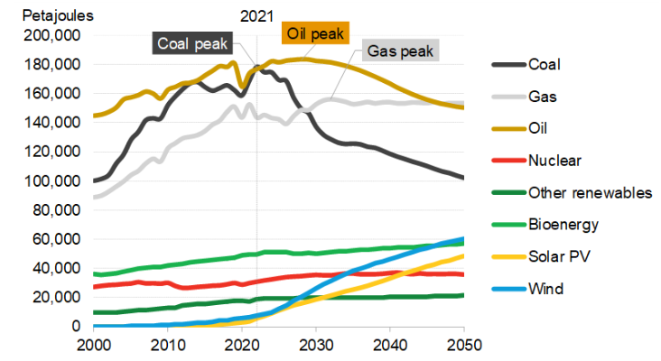
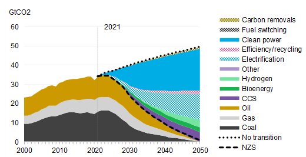

# Cambio en las pautas de consumo y movilidad post-covid

Autores - Grupo Montevideo de Universidades:

- **Ruiz Renzo** ^[reruiz96@gmail.com ]
- **Rivas Mauro** ^[maurorivas-95@hotmail.com]

## Introducción

 La pandemia de COVID-19 ha generado un cambio en las pautas de consumo
 y movilidad de la población en todo el mundo, así como en el
 desarrollo económico estimado para los próximos años.

 Una de las principales fuentes de emisión de gases a la atmósfera es
 la generación de energía. Es por eso que, frente a una etapa
 post-COVID centrada en la reconversión y la reconstrucción económica
 sostenible, se impone cambiar la forma en la que producimos,
 almacenamos y gastamos energía.

 La eficiencia energética es crucial para el cambio de juego: si
 adoptamos la eficiencia energética como primera opción de consumo para
 nuevos suministros de energía, se podría conseguir la reducción de
 emisiones necesaria para no superar el máximo de calentamiento global
 de 2 centígrados. En el Escenario de Desarrollo Sostenible (SDS por sus siglas
 en inglés), el aumento de las políticas e inversiones en energía
 limpia facilita alcanzar los objetivos de energía sostenible al
 completo. Para lograr una reducción del 40% de las emisiones para
 2030, se requiere, por ejemplo, que las fuentes de energía de bajas
 emisiones produzcan el 75% de la electricidad mundial, frente a menos
 del 40% que generan en 2019.

 Además, más del 50% de los automóviles vendidos en 2030 deberían ser
 eléctricos, frente al 2,5% de 2019.

## Efectos Guerra de Rusia y Ucrania en la energía

 El impacto acumulado de las acciones y reacciones de Rusia en la
 economía mundial es importante, empezando por la subida de los precios
 de los combustibles fósiles. Rusia y Ucrania son importantes
 productores de materias primas, y las perturbaciones han provocado una
 escalada de los precios mundiales, sobre todo de petróleo y gas
 natural.

 A medida que las bombas arrasan Ucrania, se disparan también la
 inflación y con ella, las tensiones sociales.

 Aunque nuestra región no dependa directamente de los hidrocarburos de
 Rusia, los países importadores y con una matriz energética más
 dependiente de combustibles fósiles sienten más duramente los efectos
 del aumento de precios y la reducción de la oferta, en comparación con
 aquellos con una matriz más limpia. Por su parte, los países
 latinoamericanos exportadores de petróleo y gas podrían beneficiarse
 en el corto plazo de esta escalada de precios, poniendo en pausa la
 transición hacia energías limpias.

## La transición energética 

 El peso del poder energético de Rusia refleja la centralidad que
 siguen teniendo los combustibles fósiles en la economía mundial y en
 la vida cotidiana. La transición energética, que, de tener éxito,
 sería de hecho una revolución energética, ha sido hasta ahora muy
 lenta. En 1992, año de la Cumbre de la Tierra en Río de Janeiro, los
 combustibles fósiles representaban 87% del consumo total de energía en
 el mundo. Hoy en día, representan 84%. Sin avances tecnológicos en
 materia de almacenamiento, la energía solar y la eólica siguen siendo
 fuentes de energía primaria intermitentes para la generación de
 electricidad y, aunque las ventas de vehículos eléctricos personales
 están aumentando, el transporte sobre el que funciona la economía
 mundial --barcos y camiones-- requiere productos petrolíferos.

 El aumento del costo de la energía fósil crea a la vez el deseo de
 acelerar la transición energética y --como recordatorio de lo
 dependiente que sigue siendo el mundo de los combustibles fósiles-- un
 incentivo para que

 los gobiernos den prioridad a cualquier forma de energía que se
 necesite en ese momento.

## Transición energética en Argentina

Con vistas a la "nueva normalidad", la reorganización y
 reestructuración del sistema energético presenta uno de los desafíos
 más destacados. Con una participación estimada del 2 por ciento del
 PBI y una contribución aproximada al empleo registrado del 1,3 por
 ciento, la pandemia brinda al sector energético desafíos y
 oportunidades en materia ambiental y laboral. Todo esto cobra especial
 importancia para nuestro país luego de que el precio del petróleo se
 desplomara, producto de las cuarentenas realizadas a nivel mundial, lo
 que afectó la rentabilidad de como Vaca Muerta y al mismo tiempo hizo
 que el sector petrolero requiriera el auxilio del sector público. Los
 posibles cambios e inversiones en el sector energético deben
 plantearse dentro de un marco en el que la Argentina depende, en gran
 parte, de los combustibles fósiles como matriz primaria de energía. En
 vistas a reformar esta matriz energética en el país, es destacable el
 hecho de que las energías renovables hayan triplicado su participación
 entre el 2018 y 2020. Dentro de las potencialidades del país en
 materia de energías renovables, la térmica representa el 62 por ciento
 de la potencia instalada, la hidráulica un 27 por ciento, las
 renovables (solar, eólica, biomasa, etc.) un 7 por ciento y un 4 por
 ciento la nuclear. En relación con la energía fotovoltaica, más de la
 mitad del territorio argentino recibe una radiación solar que, en
 teoría, es viable para su explotación y es superada en pocas regiones
 de Europa. El cambio del sistema energético es crucial para el
 desarrollo de otro proceso: La remodelación del sistema de transporte,
 principalmente en las ciudades y en el planeamiento urbano, donde la
 descarbonización de la economía es central. La Argentina también
 presenta un alto potencial bioenergético a partir de una gran
 diversidad de fuentes de biomasa tanto seca como húmeda susceptibles
 de ser aprovechadas. 4. Un Factor común a cualquier escenario: El auge
 de las energías renovables

 Al 2020, la energía hidroeléctrica sigue siendo la mayor fuente
 renovable de electricidad, seguida de la energía solar y la eólica
 marina. Pero de
 cara al futuro, si hay un elemento común en cualquiera de los
 escenarios energéticos es el crecimiento de las energías renovables,
 con la energía solar a la cabeza. Actualmente, construir una central
 eléctrica de carbón o de gas es ya más caro que una planta de energía
 solar fotovoltaica, pues los proyectos solares ofrecen hoy una de la
 electricidad de menor coste de la historia.

## Escenario de transición económica

 La crisis energética mundial ha hecho que las energías renovables sean
 aún más competitivas frente a la generación de electricidad a base de
 carbón y gas en muchas partes del mundo, ya que los precios de esos
 combustibles se han disparado, y muchos países y regiones están
 llevando a cabo una transición más rápida hacia las energías limpias
en apoyo de una mayor seguridad energética.

 En el Escenario de Transición Económica (ETE), que supone que no hay
 nuevas medidas políticas para acelerar la transición a la energía
 limpia, el rápido crecimiento de las energías renovables y la
 electrificación del transporte eliminan aproximadamente la mitad de
 las emisiones mundiales asociadas a la energía en 2050, frente a una
 línea de base en la que no se produce dicha transición.

 La energía eólica y solar proporcionarán alrededor de dos tercios de
 la generación de energía mundial en 2050, y estas dos tecnologías,
 combinadas con el almacenamiento de baterías, representan un
 impresionante 85% de los 23 Tera vatios de nueva capacidad de energía
 que se instalarán en las próximas tres décadas. Las emisiones del
 sector eléctrico se reducen en un 57%, y las del sector del transporte
 en general se reducen en un 22% hasta 2050, impulsadas por la
 transición del segmento de carretera a los vehículos eléctricos. El
 uso global del carbón, el petróleo y el gas alcanza su punto máximo en
 la próxima década, con el carbón alcanzando un punto máximo y
 comenzando a disminuir inmediatamente, mientras que el petróleo hará
 lo mismo en 2028 y el gas a principios de la década de 2030.

 A pesar de estos rápidos avances de las energías limpias, el Escenario
 de Transición Económica está muy lejos de lograr el cero neto a
 mediados de siglo. En 2050, las emisiones habrán disminuido un 29%,
 pero el carbón, el petróleo y el gas seguirán emitiendo 24.6
 gigatoneladas de CO2 al año. El resultado es una trayectoria
 consistente con 2.6 C de calentamiento global.

Figura 1: Consumo de energía primaria por combustible, escenario de
transición

económica

##  Escenario Cero Neto

 En el Escenario Cero Neto (NZS), se refiere a conseguir emisiones de
 dióxido de carbono netas iguales a cero equilibrando la cantidad de
 dióxido de carbono liberado a la atmósfera con una cantidad
 equivalente retirada de la atmósfera, o fijada por plantas para el
 2050. Esto requiere de un rápido despliegue de generación de energía
 limpia.

 El cambio de la generación de energía de los combustibles fósiles a la
 energía limpia es el mayor contribuyente a la reducción de las
 emisiones globales, representando la mitad de todas las emisiones
 reducidas en 2022-50. Esto incluye la sustitución de los combustibles
 fósiles no reducidos por la energía eólica, solar, otras energías
 renovables y la nuclear, tecnologías en gran parte maduras que ya
 existen a escala. En 2050, el sistema energético mundial estará
 dominado por la energía eólica (48% de la generación) y la solar
 (26%), y el resto por otras energías renovables (7%), la nuclear (9%),
 el hidrógeno y el carbón o el gas con captura de carbono.

 La electrificación del transporte y de los procesos industriales, de
 los edificios y de la calefacción es el siguiente factor que más
 contribuye a la reducción de las emisiones, reduciendo aproximadamente
 una cuarta parte de las emisiones totales durante el periodo. También
 en este caso,

 las tecnologías ya existen, aunque en el caso de la calefacción de los
 edificios y de la industria, la electrificación todavía no avanza al
 ritmo necesario.

 El resto de las reducciones de emisiones proceden del aumento de la
 eficiencia del lado de la demanda y del reciclaje, el hidrógeno, la
 bioenergía y la captura y el almacenamiento de carbono, que en
 conjunto representan aproximadamente la última cuarta parte de las
 reducciones de emisiones. Aunque parecen desempeñar un papel menor, el
 crecimiento necesario para estas tecnologías sigue siendo notable.

 Figura 2: Reducción de las emisiones de CO2 procedentes de la
 combustión de combustibles por medida, escenario Net Zero frente a
 escenario sin transición

 La limpieza del sistema energético tiene un mayor impacto en los
 países que hoy dependen en gran medida del carbón, como China (61% de
 carbón en la generación de electricidad en 2021), India (78%) y
 Australia (53%). El cambio a la energía limpia supone al menos dos
 tercios de su reducción total de emisiones en los próximos 28 años. La
 electrificación de los procesos basados en los combustibles fósiles en
 el transporte, la industria y los edificios debería ser una prioridad
 en los países que ya han reducido la intensidad de las emisiones de
 carbono de su generación de electricidad.

##  Bibliografía

- https://es.wikipedia.org/wiki/Neutralidad_de_carbono

