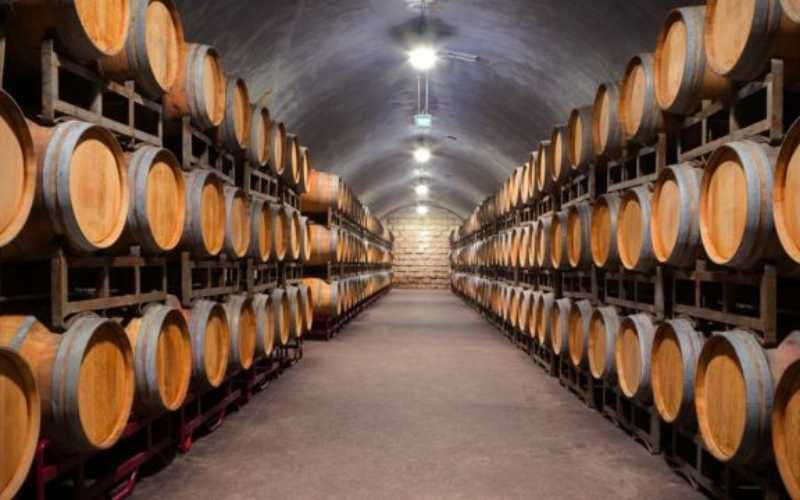
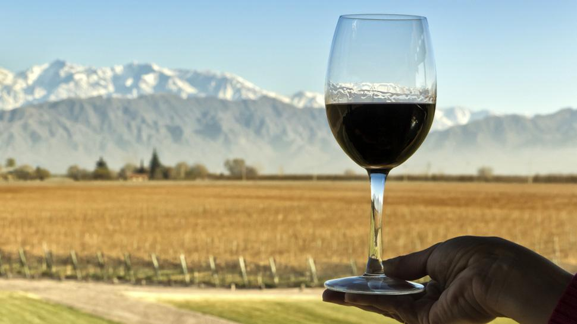
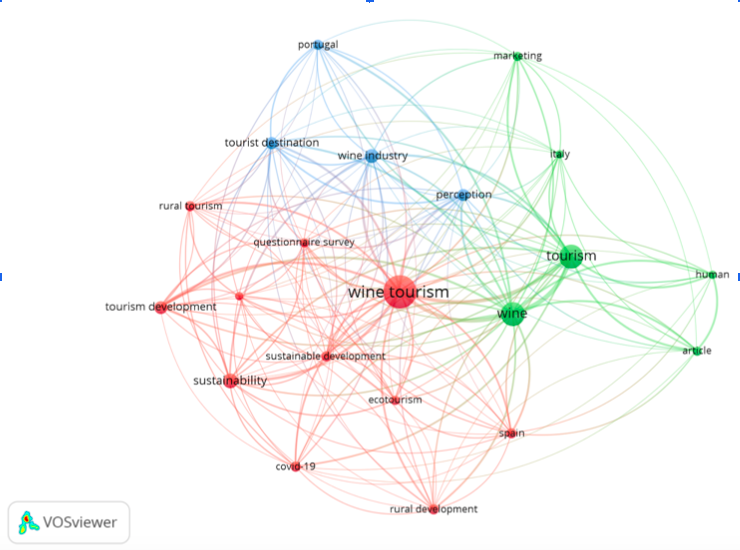
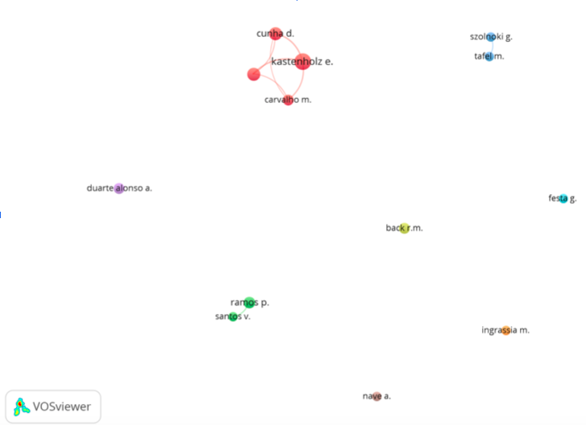

# Wine turism as a resilient trend in post covid era
Authors:

- Elias Da Rosa^[eliasemmanueldarosa99@gmail.com] 
- Facundo Moyano 
- Juan Francisco Najul^[juanfra.najul@gmail.com] 
- Alvaro Navarro 
- Guido Scopel^[Guido Scopel <guidoscopeta@gmail.com>]
- Kalindy Tillar^[kalindyvanesa@gmail.com]

## Abstract. {-} 

Twenty twenty was a completely abnormal scenario for the
wine tourism industry. To compensate for loss of business, wineries in this
industry had to apply new strategies. This study establishes a comparison
between how the wine industry tourism had to reinvent during the Covid-
19 in countries related to the New World and the Old World, creating a
benchmark to better understand the situation in Argentina. The result
of the analysis tells us what actions the industry had to adopt and the
outcome consequences in terms of customer satisfaction and business
subsistence.

## Keywords: {-}
Wine tourism · Wine · Tourism · Sustainable development · Ecotourism sustainability · Covid-19.

## Introduction

The year 2020 will be remembered as a year of disruption, when the outbreak
and spread of the COVID-19, along with the global efforts to contain it, caused
ruptures—politically, economically, socially, and technologically. The tourism
sector was severely affected as travel restrictions and lockdowns were enforced
around the world, reducing it drastically. Wine tourism is a core component
of regional tourism in Mendoza, making it one of the most important reasons
to visit the province. This study investigates the changes that wineries made
in order to adapt to the pandemic scenario, analyzing scientific investigations
carried on in the last 3 years regarding the topic and comparing international
situations with Argentina.

to find the evidence of this emergin trend and verify the positive impac that the pandemic has been into this supply chain a biblimetric approach has been made. 
The use of semantic tools let us tu identify some kywords and reveal this resilient and emergin trend.

##  Literature review

At first we started searching the following subjects using Google Scholar
and Scopus: “Post Covid Wine Tourism”, “Covid Impact on Wine Tourism” and
similar phrases. We prioritized research articles published in scientific journals
and working papers. From this search, we identified 215 studies related to the
main topic. The studies are mostly focused on European regions, analyzing how
Covid-19 affected wine tourism industries during lockdown and explaining how
the industry managed to survive the economic and social crisis. For instance,
Portugal, Italy and Spain account for 51 percent of studies, while newly wine
productor countries like the USA, Australia and South Africa account for 24
percent of the ones. Argentina, by its side, only accounts for 2 percent of the
studies. Using the VOSviewer software, this information can be represented with
a network visualization:

We can see that some countries, like Portugal, Spain, the U.K., Italy and
the USA have developed a great research network. Argentina, by its side, has
only been related to Italy and Australia. Using the software, we were also able
to take a look at the most repeated words in the searched studies. The results
are exposed in the following network visualization:

As you can see the most repeated words are “wine tourism”, “wine” and
“tourism”. It is also possible to identify that papers in which wine tourism is
mentioned, also contain many references to “sustainable development”, “eco-
tourism”, “sustainability” and “covid-19”. This makes us think that there is
a great connection between these topics. In relation to the authors this paper
is based on, the following network visualization represents the most important
ones:

Some of the authors, like Kastenholz, Carvalho and Cunha, have developed a
clear network in their studies, while others remain studying this topic in a more
individual way. The most relevant previous studies related to how the lockdown
due to the pandemic affected wine tourism industry are shown at Figure 4.

##  Materials and methods
The pandemic was a catalyst, changing the wine tourism industry of many coun-
tries, mostly in the areas of digitalisation, product delivery, and overall business
strategy. Either new strategies in all these areas had to be quickly developed,
or emergent strategies had to be expedited in order to adapt to the disruption
caused by the pandemic. Because of this, three research questions arise. The first
research question tries to understand the effect that the pandemic had on the
industry. This question is the following one: How did covid-19 affect the wine
tourism industry?. In second place, this study looks forward to understanding
the strategies developed by wineries to deal with the lockdown. It is as it follows:
What were the strategies for wineries to face the COVID-19 pandemic? Finally,
we are also interested in understanding the role that the Argentinian wine in-
dustry took in the pandemic. Therefore, the third research question is: What
strategies did the Argentinian wine industry take to deal with the lockdown?
Taking into account that lots of previous studies related to the topic have been
published, this paper is intended to be a qualitative and longitudinal study. For
that reason, we have reviewed several studies from all over the world and our
aim is to compare the situations and strategies that were developed in different
countries.

### Country selection

As it was mentioned on the Literature Review, 215 studies were taken into ac-
count to make this paper. Nevertheless, we are only going to focus on five of
the selected countries: Australia, USA, Germany, Portugal and Argentina. The
availability of on-line information was the key factor that led to the selection of
these countries. A brief description of the importance of wine tourism for each
country is provided below. Australia’s dynamic, innovative wine tourism indus-
try is driven by entrepreneurship, collaboration, co-opetition, and coordinated
strategies between all stakeholders. In 2018– 2019, a total of 8.4 million winery
visitors spent 9.6 billion Australian dollars (current exchange rate November
2022: 1 Australian dollar = 108,19 ARS) during their stay, with food and wine
offerings being a strong driver in developing these wineries as a destination of
choice. The U.S. winery industry is also characterized by innovation and a re-
silient attitude in the face of environmental challenges. It is estimated that in
2017, more than 13 million winery tourists, predominantly domestic, made over
43 million visits to American wineries, spending 17.7 billion US dollars (current
exchange rate November 2022: 1 US dollar = 161,79 ARS). Although Germany
is the largest tourism market in Europe for revenue, wine tourism as a national
strategy for sustainable regional development has only become a topic in the
last decade. Approximately 26.4 billion Euros is spent annually, generally on
tourism in the 13 winegrowing regions, with 7.3 million wine tourists amongst
the total—90 percent of whom are domestic—spending an estimated 5 billion
Euros(current exchange rate November 2022: 1 Euro = 166,98 ARS) per year. In
the case of Portugal, wine tourism and wineries have acquired an influential role

within the Portuguese tourism economy, benefiting from public support specific
to private investment and promotion to increase international tourism as well as
wine exports. Moreover, Portugal is an illustrative example of an economy whose
exports are mainly underpinned by tourism, which has strongly coupled with the
wine sector. Thus, the business that has been pursued by Portuguese wineries
prior to the COVID-19 pandemic has been strongly oriented towards tourism,
favoring direct consumer wine sales. Argentina, by its side, has the province of
Mendoza that has been growing and continues to grow steadily since the begin-
ning of the last decade, at least doubling all indicators related to tourism and
showing a very important position in Argentina. Today, around a million and a
half of tourists, of which two thirds come to Mendoza and one in four are for-
eigners, mainly from the United States, Brazil, South America and Europe. The
growth between 2004 and 2015 was more than 200 percent. In 2004, 62 winer-
ies opened in Argentina, now there are more than 200.Regarding the arrival of
Argentines and foreigners, we can say that 73.5 percent are nationals and 26.5
percent foreigners, mainly from Brazil and the USA.

### Content Analysis

As it was mentioned on the Literature Review, 215 studies were taken into ac-
count to make this paper. Nevertheless, we are only going to focus on five of
the selected countries: Australia, USA, Germany, Portugal and Argentina. The
availability of on-line information was the key factor that led to the selection of
these countries. A brief description of the importance of wine tourism for each
country is provided below. Australia’s dynamic, innovative wine tourism indus-
try is driven by entrepreneurship, collaboration, co-opetition, and coordinated
strategies between all stakeholders. In 2018– 2019, a total of 8.4 million winery
visitors spent 9.6 billion Australian dollars (current exchange rate November
2022: 1 Australian dollar = 108,19 ARS) during their stay, with food and wine
offerings being a strong driver in developing these wineries as a destination of
choice. The U.S. winery industry is also characterized by innovation and a re-
silient attitude in the face of environmental challenges. It is estimated that in
2017, more than 13 million winery tourists, predominantly domestic, made over
43 million visits to American wineries, spending 17.7 billion US dollars (current
exchange rate November 2022: 1 US dollar = 161,79 ARS). Although Germany
is the largest tourism market in Europe for revenue, wine tourism as a national
strategy for sustainable regional development has only become a topic in the
last decade. Approximately 26.4 billion Euros is spent annually, generally on
tourism in the 13 winegrowing regions, with 7.3 million wine tourists amongst
the total—90 percent of whom are domestic—spending an estimated 5 billion
Euros(current exchange rate November 2022: 1 Euro = 166,98 ARS) per year. In
the case of Portugal, wine tourism and wineries have acquired an influential role
within the Portuguese tourism economy, benefiting from public support specific
to private investment and promotion to increase international tourism as well as
wine exports. Moreover, Portugal is an illustrative example of an economy whose
exports are mainly underpinned by tourism, which has strongly coupled with the

wine sector. Thus, the business that has been pursued by Portuguese wineries
prior to the COVID-19 pandemic has been strongly oriented towards tourism,
favoring direct consumer wine sales. Argentina, by its side, has the province of
Mendoza that has been growing and continues to grow steadily since the begin-
ning of the last decade, at least doubling all indicators related to tourism and
showing a very important position in Argentina. Today, around a million and a
half of tourists, of which two thirds come to Mendoza and one in four are for-
eigners, mainly from the United States, Brazil, South America and Europe. The
growth between 2004 and 2015 was more than 200 percent. In 2004, 62 winer-
ies opened in Argentina, now there are more than 200.Regarding the arrival of
Argentines and foreigners, we can say that 73.5 percent are nationals and 26.5
percent foreigners, mainly from Brazil and the USA.

## Results of the Analysis

There were three operational factors that allowed wineries to welcome visitors
back onsite, that also had the potential to benefit the business: the implementa-
tion of a reservation system able to capture customer data; the hosting of socially
distanced, seated tastings with customized service; and dedicated time alloca-
tions, which facilitated an authentic, personal experience with the winery’s staff.
What every company needs to do, then, is create an experience that first gains
potential customers’ attention, then gets them to spend time experiencing their
offerings and finally causes them to spend their money by buying those offerings,
rather than merely the volume and value of wine sold. The findings were that
the main strategies of wineries were the intensification of online communication,
a focus on DTC (direct-to-consumer) sales, creating new sales channels, imple-
menting a home delivery service, a reduction in costs and use of public aid. One
of the strongest impacts of the crisis is the acceleration of digitalisation. With
the absence or reduction of physical visitors, wineries became heavily reliant on
digital technology, using the internet for online sales, advertising campaigns, and
virtual events. Data became the new currency to target, segment, communicate
with, and sell to customers.

### The case of Australia and USA (the New World)

The initial response to the COVID restrictions by most of the American and Aus-
tralian respondents was marked by agility, “fast pivots” to virtual approaches,
take-away offers due to visitation restrictions, and fast decision making. Sev-
eral interviewees spoke of being proactive and initiating pre-emptive strategies
when they could, yet others struggled to keep up with the ever-changing cir-
cumstances. The entrepreneurial drive to seize new opportunities and “learn by
doing”, strongly motivated by the vision of progressive owners, was cited as a
powerful force to unite staff and not only survive, but thrive, during the crisis.
Furthermore, talking about new initiatives, almost all participants acknowledged
that CRM helped—or would have helped—significantly during and after the

lockdowns: those who had a well-functioning CRM system, containing contact
information of visitors and customers, benefited greatly, being able to keep in
touch with end-consumers, inviting them to an online wine tasting or offering a
special wine package. Leveraging CRM was one of the most important initiatives
in New World countries, while in Europe, probably because CRM did not play
an important role in the past, it was less frequently mentioned. Several research
papers have proven the growing importance of DTC sales, especially in the case
of wineries, where the experience is usually more important than the product
itself. During the lockdown, the discussion was centered on making marketing
efforts to promote DTC sales, predominantly on digital platforms, or focusing
more on traditional modes (telephone, mailing lists, print, radio, billboards, etc.).
A common refrain was the need to invest in optimizing and exploiting digital
presence and performance, hiring digital expertise where necessary, to increase
reach and followers, ensuring websites were mobile-friendly and generating in-
teresting engaging content across the many social media platforms, which may
support online sales. Paid advertising, boosting posts, targeting/tracking users
from websites, and using social influencers were deemed worthy investments by
many wineries in the New World in order to capitalize on the captive audiences
at home during lockdown.
The biggest innovation to come out of the crisis was the profusion of vir-
tual tastings and events for private, corporate, and trade customers via live
streaming, such as Zoom, Instagram, Google Meets, YouTube, and other social
media platforms. This brought the challenge to produce high-quality content in
order to grow customer’s engagement through this new channel but also gave
many benefits like capturing data and creating new customers, suggesting that
they would remain as a vital part of a post-pandemic strategy, creating a new
hybrid business model whereby wineries could continue to offer virtual events
concurrent with physical ones.
As is already known, positive experiences at cellar door wine tastings have a
significantly beneficial influence on purchase intentions and the value and quan-
tity of the products purchased. Therefore, for wineries it was crucial to continue
offering this kind of experience, but in a completely new form due to the pan-
demic. In terms of operations, the most successful and agreed upon new initiative
for nearly all participating Australian and American wineries and one to be con-
tinued in the future, was the shift to reserved, seated, paid tastings with smaller
groups. Wineries wholeheartedly endorsed this as an “absolute blessing”, some-
thing they had been wanting to implement for a long time, never having the
courage to do so. These changes to the cellar door tasting experience, initially to
comply with COVID-19 regulations, created valuable benefits for both the win-
ery and customers, suggesting that it will remain constant in these countries,
beyond the crisis.
The New World adopted a progressive culture in their respective enterprises,
one of constant innovation, personalized customer focus, passionately motivated
teams, and a solid digital infrastructure to drive business. Technology was used
strategically to engage, collect, coordinate, and target messaging, while also tai-
loring social media activities, to maintain a strong emotional connection to the
brand—both internally and externally. Also, it was found that relationship man-
agement in membership associations (wine clubs) has the potential for strong
support in terms of a winery’s revenue generation. Only wineries from the U.S.
and Australia mentioned the recurring revenue of wine clubs as a resilience strat-
egy. During the COVID crisis, wine club members proved to be a loyal and stable
customer base, who continued to purchase directly and regularly from the winery
despite the crisis.

###  The case of Germany and Portugal( the Old World)

An alternative approach was taken by the majority of the German respondents,
who conveyed a more cautious approach: “at first, we wait and see what hap-
pens”. They were, perhaps, culturally more reluctant to adopt new technologies
when the return on investment had not yet been proven and the urgency was not
so apparent In the case of Portugal, much research was made. They show that
the first wave of the COVID-19 had a deep impact on Direct To Consumer wine
sales in the tasting room. The results show that the impact is independent of
size and experience, as well as from average consumer spending on tasting room
wines in the past and the typology of wine sold, defined by the average price
per bottle sold. Also, this studies indicate private and public measures that can
be put in place to foster resilience in such events which are independent of the
firm structure In relation to some short-term measures, new digital initiatives
are a priority to bypass and moderate the dependence on DTC wine tasting
rooms, namely by including virtual wine tastings with participants that can pre-
order wines and announce new services and products to relieve the effect of a
possible closure of business premises due to lockdown measures. Also, wineries
will benefit from adopting new distribution channels and digital marketing ini-
tiatives, such as Online-Merge-Offline (OMO), that enables offline retailers to
tap into existing e-commerce platforms, and social media marketing, to provide
value to customers and new opportunities to build brand awareness by allow-
ing an opportunity to engage with prospective tourists. Furthermore, given that
wineries with lower brand recognition were the most to suffer deeper wine sales
reductions, it is recommended that wineries invest in brand recognition, which
involves the previously underlined digital strategies and cooperation with the
governance system and specifically public agencies to engage in national and
international marketing initiatives. Moreover, strategic alliances between winer-
ies, and between wineries and distributors, will be vital to reducing transaction
costs and to overcoming technical and legal barriers, in a symbiosis of individ-
ual and collective recognition reinforcement and wine-tourism interconnection.
Despite the urgency in adopting digital transformation to accelerate the growth
and resilience of wine tourism businesses, which are predominantly located in
rural areas, this measure is not entirely dependent on the winery’s decision and
needs more structural and medium and long-run public policy measures. For
instance, the lack of physical and digital infrastructures required to sustain wine
tourism operations in these areas calls for the participation of public governance
systems to guarantee that technical conditions are put in place to allow this
transformation to happen.

### The case of Argentina

The province of Mendoza, which represents 70 percent of the national produc-
tion and about 85 percent of the commercialization of bottled wines, has led in
recent years wine tourism development projects that unite the public and pri-
vate sectors of both tourism and wine. Wine tourism has allowed wine producing
provinces to gain a space in Argentine tourism that they did not have before. It
is based on the extraordinary presence of the vineyard and winery and all the
magic and history around wine. The growth between 2004 and 2015 was more
than 200 percent. In 2004, 62 wineries opened in Argentina, currently there are
more than 200. As for the arrival of Argentines and foreigners, we can say that
73.5 percent are nationals and 26.5 percent foreigners, mainly from Brazil and
USA. At the beginning of the Pandemic, the wine industry asked to be included
in the Emergency Assistance Program for Labor and Production of the national
government and argued for a 30 percent drop in consumption since the begin-
ning of the mandatory confinement by Covid-19. Since the greatest impact comes
from the abrupt closure of restaurants, bars, free shops, cruise ships and private
parties. And so the situation of wine tourism was reduced to zero. In addition,
the Chamber of the Wine Industry of the Argentine Republic asked the National
Government for a package of specific measures to maintain the activity of the
sector at a minimum subsistence level that guarantees the non-closure of the
companies and the continuity of the thousands of jobs that depend on them. It
was requested that the National Government exempt wine stores throughout the
country from quarantine. The approximately 5,000 existing wine shops are all
SMEs and are an extremely important channel for the SME wineries themselves,
which do not have the possibility of reaching large chains of hypermarkets, super-
markets and other distributors. As hotels, restaurants and bars are also closed,
the same SMEs wineries do not have any channel to market their wines in the
country. In a context of reactivation and in the face of the challenges that the
COVID-19 pandemic continued to face, the articulation between the private and
public sectors is essential for the recovery of the different sectors affected, as is
the case of tourism. With the aim of boosting and contributing to the devel-
opment of wine tourism in the country, an agreement was signed between the
Secretariat of Tourism Promotion of the Ministry of Tourism and Sports of the
Nation and the Argentine Wine Corporation (COVIAR) to update the Market-
ing Plan ”Argentina Tierra de Vinos”. Wine tourism is a driving force for the
development of regional economies due to the number of quality jobs it gener-
ates, directly and indirectly, and it is also a promoter of the cultural identities
and traditions of the destinations. One of the objectives is to understand the
context of wine tourism and the experiences of Argentine tourism during the
pandemic, as well as the impact and future economic expectations of the sector
in the short, medium and long term; and the imaginary and desires for the return
of the activity in a post-pandemic scenario. This strategic alliance has been the
result of the articulated work between the provinces, COVIAR and the National
Ministry of Tourism and Sports. Argentine wine is a Country Brand, has its own
identity, highlights the regions and is complemented by gastronomy and rural
tourism. The update of the Marketing Plan ”Argentina Tierra de Vinos” aims,
from the survey of statistics, surveys and focus groups in the main cities of the
country, to know the preferences and tastes of actual and potential tourists to
advance in a diagnosis and strategic proposal that will then be made available
to wine tourism operators in all wine provinces so they can plan their differ-
ent strategies, adapt their offer to new preferences and advance in promotional
actions for the development of the sector.

## References
1. Author, Jane Eastham.: Post-COVID-19 developments in the wine tourism sec-
tor(2022). (https://www.taylorfrancis.com/chapters/edit/10.4324/9781003143628-
55/post-covid-19-developments-wine-tourism-sector-jane-eastham)
2. Author, Maria Alebaki, Maria Psimouli and Stella Kladou. Social Media for Wine
Tourism: The Digital Winescape of Cretan Wineries in the Era of COVID-19
(2022). (https://www.emerald.com/insight/content/doi/10.1108/978-1-80117-081-
920221006/full/htm
3. Author,
 Alexandre
 Guedes,
 Britta
 Niklas,
 Robin
 M
 Back
 and
Joao Rebelo. Implications of an exogenous shock (COVID-19) on
wine
 tourism
 business:
 A
 Portuguese
 winery
 perspective
 (2022).
(https://journals.sagepub.com/doi/full/10.1177/14673584221085214)
4. Author, Elisabeth Kastenholz. Covid-19, Wine routes, crisis man-
agement and resilience amongst rural wine tourism business (2022).
(https://dergipark.org.tr/en/download/article-file/1740307)
5. Author, Marc A. Rosen. A Cross-Cultural Comparison of New Implemented Sus-
tainable Wine Tourism Strategies during the COVID-19 Crisis(2022).
6. El
 turismo
 del
 vino,
 una
 actividad
 en
 constante
 crecimiento.
(crecimiento.(https://webunwto.s3-eu-west-1.amazonaws.com/imported-
images/44020/turismo-del-vino-cornejo.pdf)
7. Author, Juan Diego Wasilevsky. Coronavirus y el golpe al turismo del vino: bodegas
entran en modo cuarentena(2020).(https://www.iprofesional.com/vinos/311599-
coronavirus-y-el-golpe-al-turismo-del-vino-bodegas-en-modo-cuarentena)
8. La induastria del vino pide al gobierno nacional un paquete de medidas para sobrelle-
var la crisis (2020). (tps://www.bodegasdeargentina.org/la-industria-del-vino-pide-
al-gobierno-nacional-un-paquete-de-medidas-para-sobrellevar-la-crisis/noticias/)
9. Roxana Baldaloni. Coronavirus en Argentina: cayó 30 percent el consumo del vino
y la industria pide ayuda (2020). (https://www.clarin.com/economia/coronavirus-
argentina-cayo-30-consumo-vino-industria-pide-ayuda-0-ejpQgKayC.html)
10. El Plan ”Argentina Tierra de Vinos” se pone en marcha (2021).
(https://www.agrositio.com.ar/noticia/218221-el-plan-argentina-tierra-de-vinos-se-
pone-en-marcha)
11. Metodologı́a
 de
 la
 investigación.
 (https://www.uca.ac.cr/wp-
content/uploads/2017/10/Investigacion.pdf)
12. Author,
 Ricardo
 Palma.
 Metodologı́a
 de
 la
 investigación.
(https://drive.google.com/file/d/1CXtbcFSiMFOlyE5ZMxnS6C359ZxHZCDo/view)

