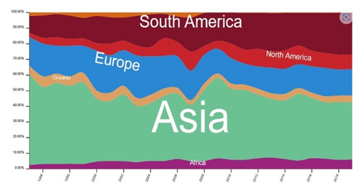
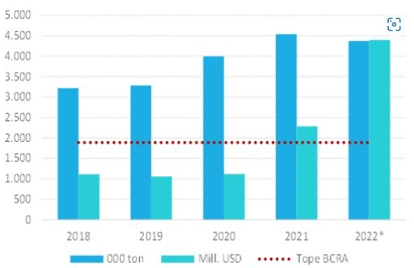
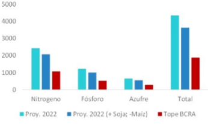

# Los fertilizantes en la post-pandemia  
## Impacto de la crisis energética y alimentaria {-}

Autores:

- Calle, Jacinta;
- Juan Ignacio Cámpora;
- Puliafito, Felipe;
- Salvarredi, Agustina

## Abstract {-}

During the last years, the global consumption of fertilizers has shown a negative trend, which is also
reflected in the Argentine agricultural sector. It should be noted that in 2020, Argentina imported
1MM pesos in fertilizers, becoming the 14th largest importer of fertilizers in the world. Therefore,
the negative trend in imports, which has a direct impact on the availability of fertilizer in Argentina,
which the fertilizer market has suffered, is closely related to the mutation that has been affecting
supply chains in the post-Covid era. Therefore, this article will seek to investigate the problem
caused mainly by the centralized trade of fertilizers in Argentina and by the low annual import of
organic fertilizers, which directly impact the low availability of organic fertilizers.
Keywords: fertilizante, supply chain, post-covid, gestión de la cadena de suministro, fertilizantes orgánicos,
diseño de planta, gestión de residuos orgánicos.

## Introducción

El 11 de marzo del año 2020, la Organización Mundial de la Salud (OMS), declaró que el brote del coronavirus
es una pandemia, (OMS, 2020) esencialmente por la velocidad en su propagación, e instó a los Estados a tomar
acciones urgentes y decididas para la identificación, confirmación, aislamiento, monitoreo de los posibles casos y la
divulgación de las medidas preventivas para redundar en la mitigación del contagio. Según Endashaw, Joby, Joan,
N. y Sendhil R. (2020), el rápido desplazamiento del Covid 19 a los paı́ses en desarrollo, provocarı́a consecuencias
gravı́simas sobre todo en temas de agricultura, debido a que de ella depende la seguridad alimentaria no solo
de ellos sino también de muchos paı́ses del mundo. En los últimos años los precios de los fertilizantes recibieron
un gran incremento cercano al 10 porciento, lo que impacta mucho sobre el productor. Dada la importancia de
los fertilizantes importados en Argentina, las importaciones crecieron y a eso se suman las preocupaciones por
las medidas que impone el BCRA para la adquisición de divisas para importación. A partir de esta situación se
analizan dos escenarios: Suponiendo una menor siembra de maı́z, que se destinarı́a a producir soja. Esto bajarı́a
los requerimientos de importaciones, pero implicarı́a un menor ingreso de divisas por granos. Suponiendo que los
precios se mantienen a los niveles de junio de 2021. En ambos casos, se superan por mucho los lı́mites impuestos
por el BCRA. El lı́mite solo se podrı́a compensar si los precios de los fertilizantes a importar caen. El BCRA ha
tomado medidas que buscan otorgar más flexibilidad a las importaciones de insumos, pero no otorgar prioridades
a los mercados de fertilizantes se traducirı́a en menor disponibilidad de divisas, debido al potencial impacto en
producción que tienen dichas restricciones. Argentina tiene un enorme potencial para crecer en rendimientos por
hectárea de manera sustentable, a través del cierre de las brechas tecnológicas en donde la fertilización es un
componente esencial. La inestabilidad que se genera por la incertidumbre de los mercados de fertilizantes por su
impacto en los costos de los productores como la incertidumbre de la futura disponibilidad de dicho producto para
los cultivos, genera preocupaciones en los paı́ses productores como Argentina y, sumado a la preocupación del
BCRA para adquirir divisas para la importación, se analiza el contexto para el 2022/2023. Por ende, la hipotesis
que se buscará responder será si actualmente se busca satisfacer la demanda de fertilizante de la manera más
zonal posible.

## Estado del Arte

Para la búsqueda de los artı́culos cientı́ficos se utilizó la siguiente metodologı́a explicada a continuación, se
utilizaron cuatro buscadores como Science Direct, Scopus y Google Académico. Para dicha búsqueda primero se
estableció un flujo con determinados filtros, posteriormente se encontraron 329 resultados por palabra a los cuales
se le añadió el filtro de periodos estableciendo la era post-covid. Como resultados se obtuvieron 88 papers. Luego
se procedió con la revisión del Abstract e introducción de cada artı́culo los cuales solo 25 papers tuvieron más
aproximaciones con lo buscado. Finalmente, se depuraron los artı́culos que solo tenı́an una coincidencia con la
problemática y técnica aplicada.

## Mercado global

En 2021, los precios de los fertilizantes recibieron un gran incremento. Según el Banco Mundial el precio promedio
de los fertilizantes tuvo un aumento del 164 porciento de 2020 a 2021 (Figura 1). Todo es debido a un aumento
en los precios de los insumos de los productores y restricciones a la exportación por parte de los principales
productores.

Figura 1: Precio Internacional de Fertilizantes - USD/Ton. Fuente: Bolsa de Cereales en base al Banco
Mundial.

Como se ve en el Figura 2, Rusia, China, Canadá y Marruecos son los principales exportadores netos de fertilizantes. Rusia participa en un 14 porciento del comercio global, seguido por China que representa el 12 porciento,
por lo que los cambios en dichos paı́ses son de importancia para el comercio global de estos insumos.

Figura 2: Principales exportadores netos de fertilizantes - 2019 - Miles de mill. USD. Fuente: Atlas of
economic complexity.

Durante 2021, el incremento del precio del gas natural redujo la producción de amonı́aco, que repercutió en la
producción de fertilizantes basados en nitrógeno. A la vez, el aumento de precios del carbón en China incrementó
los costos de electricidad y ambos efectos resultaron en una disminución de la producción. Dado este contexto,
China implementó una cuota para las exportaciones de fertilizantes para asegurar la disponibilidad de este producto a nivel nacional y tuvo como consecuencia una gran baja del 26,3 porciento en la exportación de fertilizantes
a nivel global, lo que hizo disminuir la oferta del mismo.

***Figure 3:*** Principales flujos de comercio de fertilizantes - 2020 - USD. Fuente: Bolsa de Cereales en base
a resourcetrade.earth.

En 2022 la situación continuó con un alto grado de volatilidad e incertidumbre por la invasión de Rusia a Ucrania.
Este hecho conlleva a una gran alza en los precios, reflejando las preocupaciones sobre el efecto que tendrı́a la
guerra sobre el mercado de los fertilizantes dado que Rusia es quien lidera el mercado de dicho producto. La
reciente caı́da de los precios se atribuye a la disponibilidad de nueva información que indicarı́a que, aunque Rusia
anunció restricciones a las exportaciones de fertilizantes hasta junio de 2022, no resulta claro si estas restricciones
se han puesto en práctica dado que Estados Unidos y Brasil han reportado importaciones de fertilizantes rusos.
Además, a medida que las sanciones internacionales para el acceso a las divisas extranjeras a Rusia por la guerra
empiezan a tener efecto, se produjo la reintroducción de los fertilizantes chinos al mercado mundial, que culminó
en un aumento de la oferta mundial.

***Figura 4:*** Participación en las importaciones mundiales de fertilizantes - valor. Fuente: Bolsa de Cereales
en base a Atlas of economic complexity.

Todos estos hechos indicarı́an que, el mercado de fertilizantes serı́a menos ajustado de lo que inicialmente se
esperaba y, por lo tanto, los precios parecerı́an haber tenido una reacción excesiva. Sin embargo, es importante
señalar que cuanto más dure la guerra en Ucrania, mayor incertidumbre se generará en relación con los efectos
sobre el mercado de fertilizantes y, con ello, sobre el sector agrı́cola en conjunto.

## Mercado local

Estas variaciones en el mercado de los fertilizantes se observan con preocupación en Sudamérica por la necesidad
que tienen sobre estos productos para la producción agrı́cola. Por otro lado, al observar el interior de los mercados
tanto brasilero como argentino, ambos paı́ses dependen en gran medida de las importaciones para satisfacer las
necesidades de fertilizantes de su sector agrı́cola (Figura 5).

Figure 5: Mercado de fertilizantes según nutriente 2020 - Miles de ton. Fuente: Bolsa de Cereales en
base a FAOSTAT.

Las cifras de Argentina en el 2020 fueron 5,3 millones de toneladas de fertilizantes, de los cuales 56 porciento
eran fertilizantes nitrogenados, 38 porciento fosfatados y 6 porciento azufrados. Aproximadamente el 65 porciento de estos fertilizantes utilizados son importados, siendo China, Egipto, Marruecos y EE.UU. los principales
proveedores. El 35 porciento restante del consumo de fertilizantes en Argentina proviene de la producción de la
industria nacional. En los últimos años, la industria nacional ha experimentado un crecimiento notable. Desde
el año 2000, el consumo de fertilizantes producidos en el paı́s ha aumentado un 650 porciento . Aunque el consumo de fertilizantes ha aumentado drásticamente en las últimas décadas, Argentina sigue muy por detrás de
otros importantes paı́ses productores agrı́colas. Respecto de la aplicación de fertilizantes por hectárea de tierra
cultivable, Argentina ocupa el puesto 111 en el mundo, según datos del Banco Mundial. La guerra entre Ucrania
y Rusia ha creado una gran inestabilidad en los mercados agrı́colas y Argentina está en una posición singular para
aprovechar la situación y establecerse como una potencia agrı́cola global. No obstante, la suba en los precios de
los fertilizantes plantea un importante desafı́o para la aplicación de estos insumos.

Figure 6: Argentina - variación interanual de las relaciones insumo producto (2022 vs. mismo mes 2021).
Fuente: Bolsa de Cereales en base a AACREA.

Los porcentajes indican cuánto más de producto es necesario para comprar una tonelada de insumo. Bajo este
contexto, los bajos niveles de fertilización en el sector agrı́cola argentino significan que, en comparación con otros
paı́ses, Argentina se verı́a mucho menos afectada por las inestabilidades en el mercado de fertilizantes. De todas
maneras, es importante resaltar los efectos negativos de una menor fertilización sobre los rendimientos y la calidad
de los granos obtenidos, ası́ como en el cuidado de los suelos. Por lo que polı́ticas para favorecer la aplicación de
fertilizantes y cerrar las brechas tecnológicas entre productores son aún más relevantes bajo el contexto actual,
para aprovechar el potencial de Argentina para un crecimiento de los rendimientos de manera sustentable.

## Desafı́os locales

Además de la situación que se deriva de la volatilidad en los mercados internacionales, Argentina se encuentra
ante una escasez de divisas que llevó al BCRA a fijar cupos al acceso al mercado de cambios para importaciones.
Tomando cantidades promedio de los años 2020 y 2021, y considerando los precios observados hasta junio de 2022,
se proyectan importaciones para el resto de los meses del año por encima de los máximos históricos.

***Figure 7: Importaciones mensuales de fertilizantes y proyección 2022*** .
Fuente: Bolsa de Cereales a partir
de datos del Indec.El área sombreada representa los máx. y mı́n. entre 2018 a 2021. *Proyectadas s/
promedio cantidad 2020 y 2021, y precios 2022, asumiendo que no existen barreras al acceso a divisas.

La Figura 7 muestra los volúmenes y valores importados históricamente, ası́ como los proyectados para el 2022.
Se asume que se importarı́an cantidades iguales al promedio 2020-2021, a los precios promedios para los meses
enero-junio de 2022. Puede apreciarse que, más allá de que existe un crecimiento del volumen de fertilizantes
importados, los precios de 2021 y 2022 implicaron un salto considerable de los montos en dólares.

***Figure 8: Importaciones de fertilizantes históricas y proyectadas.*** Fuente: Bolsa de Cereales a partir de
datos de Indec.

También se muestra el cupo impuesto por el BCRA que, anualizado, se estima en 1.889 millones de dólares, cifra
que mucho más baja que el valor de las importaciones proyectada para 2022 (4.398 mill. USD) y se traducirı́a
en la necesidad de reducir las importaciones a niveles aún más bajos que los observados en 2021 (2.285 mill.
USD). La evolución de las importaciones acumuladas durante los meses de 2022 puede verse en la Figura 9. Es
interesante notar que, de ser operativo el tope, se alcanzarı́a en el mes de agosto, quedando un 57 porciento de
las necesidades de importación sin cumplir hacia fin de año.

Figure 9: Importaciones de fertilizantes acumuladas mensuales en 2022. Fuente: Bolsa de Cereales a
partir de datos del Indec.

## Análisis de escenarios alternativos

Analizado el contexto, es evidente que las restricciones a las importaciones son una gran limitante para la producción pudiendo ocasionar mayores restricciones futuras por una consecuente disminución en la producción
por una menor fertilización. Sin embargo, resulta interesante analizar qué ocurrirı́a en escenarios alternativos
propuestos para evaluar la sensibilidad de los resultados aquı́ mostrados.

### Primer escenario

En la Figura 10 se pueden ver los valores de importaciones de fertilizantes ante el caso hipotético en el cual en la
campaña 2022/2023 se siembren 3 millones menos de hectáreas de maı́z, que pasarı́an a destinarse al cultivo de
soja. Aún en este escenario extremo se requerirı́an importaciones de fertilizantes por 3.742 millones de dólares,
Vale destacar que este cambio en la producción implicarı́a un menor ingreso de divisas por exportación de granos,
de 1.350 millones de dólares, lo que implicarı́a un perjuicio neto para la balanza de pagos. Además de los efectos
sobre la sustentabilidad de los sistemas productivos.

Figure 10: Importaciones de fertilizantes según escenarios de área (mill. USD). Fuente: Bolsa de Cereales.

### Segundo escenario

Al considerar que los precios de fertilizantes experimentaron un retroceso, tendencia que podrı́a continuar, si se
toman los precios de junio de 2021 se puede proyectar el valor de las importaciones para el 2022 en la Figura 11.
Esto implica una baja en valor respecto al primer escenario, pero igualmente se superan ampliamente los montos
impuestos por el BCRA.

Figure 11: Importaciones de fertilizantes según escenarios de precios (mill. USD). Fuente: Bolsa de
Cereales.
Para que las importaciones alcancen el lı́mite habilitado por el BCRA sin compensar vı́a cantidades, los precios
de los fertilizantes a importar deberı́an caer, en promedio, un 58 porciento adicional con respecto a los precios
observados en junio de 2021.

## Nuevas medidas

Para paliar la situación respecto a la necesidad de autorizar y asegurar la disponibilidad de divisas para las
actividades productivas, el BCRA tomó medidas que buscan otorgar más flexibilidad a las importaciones. Los
cambios habilitan el uso de prefinanciaciones de exportaciones, de manera que empresas que sean exportadoras de
granos pueden recurrir al mecanismo para la importación de insumos. Además, adaptar un modelo de gestión de
la cadena de suministro conlleva a ahorros para la organización y aumentar indicadores de satisfacción del cliente
debido a la precisión en las entregas de los pedidos (Cole, B.M. Bradshaw, S.)

## Conclusiones

Dada la elevada volatilidad y las dificultades que existen hoy en los mercados de fertilizantes que amenazan con
una menor disponibilidad de divisas más las restricciones que impone el BCRA, pueden llevar a una reducción
en la aplicación de fertilizantes que puede ocasionar una reducción en los rendimientos de los cultivos y, en
consecuencia, un impacto negativo en producción que ocasionarı́a una reducción de entrada de divisas, formando
un cı́rculo vicioso que ocasiona una reducción continua del mercado, sumado a que se produce una degradación
de la fertilidad nativa del suelo, ejemplificada en las marcadas disminuciones de materia orgánica y las caı́das
en la productividad. El Covid 19, es una agravante a los problemas de seguridad alimentaria, que ya tiene el
planeta ocasionados por el cambio climático y las guerras; como respuesta a estos procesos se requiere aumentar
la inversión en tecnologı́a que asegure la producción desde el campo de alimentos saludables y que puedan llegar a
los mercados garantizando el suministro, otra propuesta es la producción en lugares cercanos a los centros urbanos
para evitar la logı́stica de transporte y, asegurar el consumo local. (Henry R, 2020)
Por lo tanto, se concluye que la tendencia es comenzar a sustituir a los fertilizantes, en parte, de manera más
local, aunque actualmente no es ası́ porque es un proceso que lleva cierto tiempo. Donde primero se sustituirá será
en el mercado de fertilizantes para jardines de casas particulares, ya que es más fácil de sustituir por productos
alternativos como el compost orgánico. En el sector agrı́cola es más difı́cil de sustituir porque dichos productos
alternativos no contienen la elevada cantidad de nitrógeno, potasio y fósforo que trae el fertilizante industrial.

## Bibliografı́a

1. Cole, B.M. Bradshaw, S. “The planning and optimisation of a supply chain network under conditions of
uncertainty” Jornal Article, 2016.
2. Endashaw, W; Joby, M; Nyika, J; y Sendhil R. (2020). Deciphering the impact of COVID-19 pandemic on
food security, agriculture, and livelihoods: a review of the evidence of developing conuntries. Environment
Institute for Sustainability Development, Tongji Univerity, Shanghai, China PR.
Obtenido de https://doi.org/10.1016/j.crsust.2020.100014.
3. Henry R. (2020). Innovations in agriculture and food supply in Resposed to the COVID-19 pandemic.

4. Organización Mundial de la Salud. OMS (11 de 03 de 2020). Alocución de apertura del director de la
OMS en la rueda de prensa sobre COVID-19. Obtenido de https://www.who.int/es/director-general/
speeches/detail/who-director-general-s-opening-remarks-at-the-media-briefing-on-covid-19--11-march-2020

**Meteriales complementerios**

https://github.com/juanicamp/Tecnicas-y-Herramientas-Modernas-II



