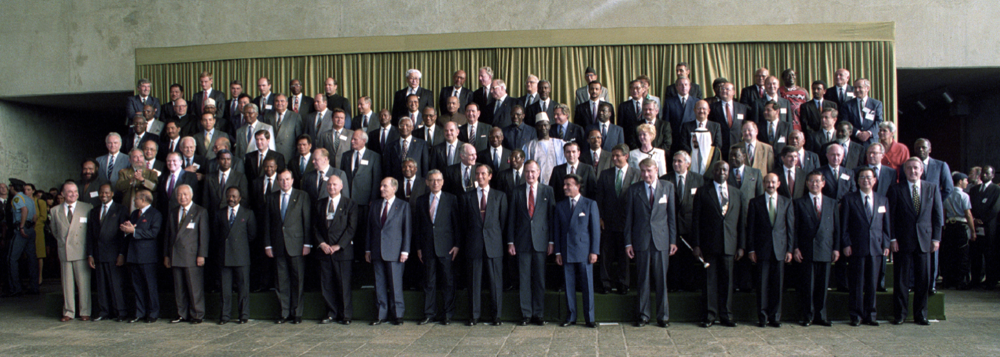
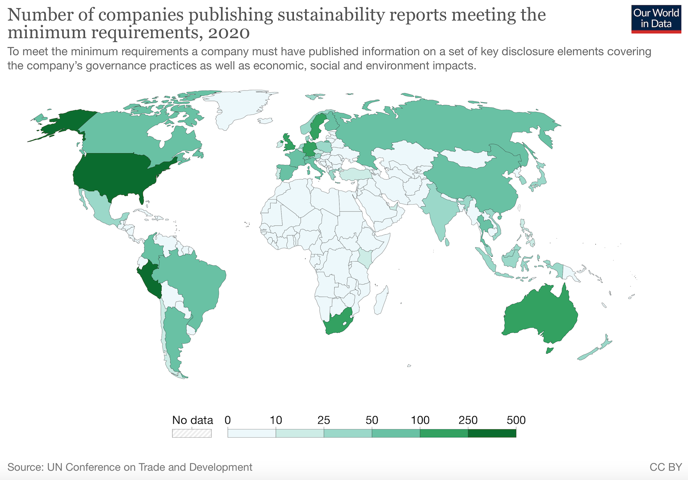
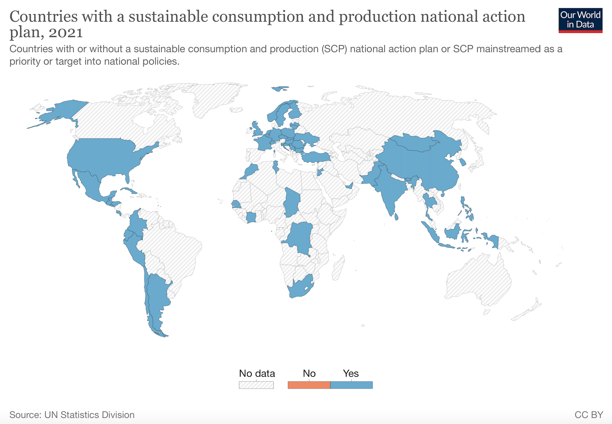

# Modelo Triple Helice su vigencia post COVID

Grupo R-Ladies Mendoza - UNCuyo

Autores: 

* Gori Renata ^[renatagori99@gmail.com ]; 
* Landi Sofía ^[sofialandip@gmail.com]; 
* Royo Rocío ^[royorocio4@gmail.com]; 
* Portabella Julia ^[juliaportabella@gmail.com]

**RESUMEN **
La pandemia del Covid-19 es un hito en la historia de la humanidad que ha marcado un antes
y un después en la manera en que concebimos la vida, en la manera en que nos relacionamos
con los demás y el medio que nos rodea. La gran pregunta es, ¿qué hemos aprendido como
sociedad para esta nueva era post pandemia? Se revalorizan conceptos ya conocidos como lo
son responsabilidad social, consumo responsable, preservación del medio ambiente, y
sostenibilidad. Las empresas que gestionamos son un reflejo de nuestra sociedad, y como
tales, responden a las decisiones que tomamos como consumidores. El gran tema en el
mundo post-covid son los nuevos hábitos de consumo y cómo las empresas deben adaptar su
producción a este público que presiona cada vez más con el cuidado del medio ambiente.
Palabras claves: sostenibilidad, consumo responsable, post-covid, cambio climático.

## INTRODUCCIÓN

La nueva realidad que se transita a partir de los eventos desencadenados por la pandemia del
coronavirus y la guerra entre Rusia y Ucrania invita a las sociedades a reflexionar y repensar
sobre los modelos productivos actuales, modelos lineales y extractivos, que no aseguran la
continuidad de los recursos en un futuro no lejano, y el rol que debemos cumplir dentro del
ciclo productivo para asegurar nuestra posterioridad.
El año 2015 significó un importante paso para la humanidad en cuanto a la sostenibilidad y a
nivel de integración entre países, gobiernos regionales y comunidades. Es entonces cuando la
Asamblea General de las Naciones Unidas formuló un documento que estableció 17 Objetivos
de Desarrollo Sustentable a alcanzar antes del año 2030.
Es quizás, hasta el momento, el plan más ambicioso desarrollado por la humanidad en lo que
refiere a la protección y cuidado del medioambiente: requiere la acción conjunta y
cooperativa de 193 países miembros de la Organización de las Naciones Unidas; las metas
serán puestas en duda por países argumentando que van contra sus intereses nacionales,
como es en el caso de Brasil durante el mandato de Jair Bolsonaro, período en el cual se
intensificó la deforestación de la selva amazónica en pos de un aumento del cultivo de soja.
Tan solo en 2019, el Amazonas perdió 2,7 millones de hectáreas (1) según una investigación
realizada en conjunto entre el IPAM (Instituto de Investigación Ambiental del Amazonas) y
la Universidad Federal de Acre.
La cumbre pionera en tratar el desarrollo sostenible fue la que tuvo lugar en Estocolmo,
Suecia en 1972. Se denominó Conferencia de las Naciones Unidas sobre el Medio Humano, y

tal como dice su nombre, su orientación fue marcadamente antropocentrista: “El hombre es
a la vez obra y artífice del medio que lo rodeo, el cual le da sustento material y le brinda
oportunidad de desarrollarse intelectual, moral, social y espiritualmente [...]”. (2) extraído
de la Declaración y Plan de Acción de Estocolmo.
La mayor crítica que obtuvo dicha conferencia fue en cuanto a la diferenciación que se hizo
entre el hemisferio norte, cuyos problemas climáticos tenían sus orígenes en las industrias, y
el hemisferio sur, quien reclamaba la falta de agua potable y cloacas. Esta división dificultó el
llegar a un acuerdo económico sin embargo precedió a la Declaración de Río (1992) 20 años
más tarde.

Figura 1. Foto de grupo de los líderes mundiales ^[reunidos en la 'Cumbre para la Tierra' en Río de Janeiro, Brasil, 13 de junio de 1992. Foto ONU/Michos Tzovaras]

Es en esta oportunidad denominada coloquialmente “Cumbre para la Tierra” se reúnen los
jefes de estado de las Naciones involucradas, en total 179 países, lo cual le da un grado mayor
de importancia frente a Estocolmo que fue llevada a cabo por ministros y cancilleres de
medio ambiente.
De carácter antropocentrista, el principio número uno de la Declaración de Río, establece:
“Los seres humanos constituyen el centro de las preocupaciones relacionadas con el
desarrollo sostenible. Tienen derecho a una vida saludable y productiva en armonía con la
naturaleza” (3). Esto es así debido a que hubo un momento en el cual se distorsionó a favor
de quién serían dirigidos los esfuerzos ¿animales, hombres, plantas, Dios?. Además, se
sostuvo que las acciones deberían ser preventivas, ya que una vez que se ha hecho el daño,
este era muy difícil de remediarse, y que las naciones soberanas debían aceptar la
responsabilidad si sus actos perjudicasen al medio ambiente, reconociendo que no existían
fronteras en cuanto se trata de la problemática medioambiental. Quedan entonces los
siguientes acuerdos vinculantes: Programa 21; Declaración de Río; y Declaración de los
Principios Forestales.
Al llegar el milenio, ya se había establecido en Nueva York tres años antes el plan de
evaluación quinquenal del progreso realizado tanto por países, organizaciones no
gubernamentales y la sociedad en sí desde la Cumbre para la Tierra, donde se propuso un
Plan para la ulterior ejecución del Programa 21. Precedida por una campaña de
información con el objetivo de alinear los intereses de todos los participantes, la Cumbre del
Milenio se desarrolló en la Sede de las Naciones Unidas en Nueva York entre el 6 y 8 de

septiembre del año 2000, donde representantes de 189 países se comprometieron a cumplir los 8 Objetivos del Milenio (ODM) (4):

1. Erradicar la pobreza extrema y el hambre;
2. Lograr la enseñanza primaria universal; 
3. Promover la igualdad entre los géneros y la autonomía de la mujer;
4. Reducir la mortalidad infantil;
5. Mejorar la salud materna;
6. Combatir el VIH/SIDA, el paludismo y otras enfermedades;
7. Garantizar la sostenibilidad del medio ambiente;
8. Fomentar una asociación mayor para el desarrollo.

El análisis que se desprende de los 8 ODM tiene dos frentes: en un primer lugar, se establece
al hombre como principal actor y beneficiario de toda acción preventiva, entendiéndose que
para su correcto desarrollo se debe disponer de un medio ambiente sano, y que satisfacer las
necesidades básicas es primordial para alcanzar el desarrollo sostenible de la comunidad
internacional. Por otro lado, se hace hincapié en la acción conjunta entre actores
entendiéndose que sólo a través de la asociatividad y la colaboración se puede cumplir con
estos objetivos.
Los 8 ODM serían evaluados posteriormente en las cumbres de 2005, 2008 y 2010 en Nueva
York. En dichas reuniones se declaró de suma importancia la intensificación de las acciones y
la toma de medidas efectivas en carácter de urgencia. Se destacó la participación cooperativa
de los países, quienes en conjunto desarrollaron mecanismos de mitigación de las
problemáticas: pobreza, hambre y enfermedades principalmente.
Respecto de este punto, y analizando el contexto actual de pandemia y guerra, cabe
reflexionar ¿ha fracasado el hombre como sociedad en lograr los Objetivos del Milenio
propuestos? ¿Se puede pensar en un “bache” que permite realizar acciones correctivas a
tiempo?
Entre tanto, se celebra en Johannesburgo, Sudáfrica en el año 2002 una nueva Cumbre
Mundial sobre el Desarrollo Sostenible que concluye con la redacción de los documentos
titulados Declaración política y Plan de Implementación los cuales ponen en manifiesto y
reafirman el compromiso de los países del globo para la “erradicación de la pobreza,
modificación de pautas insostenibles de producción y consumo, protección y ordenamiento
de las bases de recursos naturales para el desarrollo social y económico” (5).
El texto incluye disposiciones sobre el Protocolo de Kioto (6) celebrado en el año 1997 en
Kioto, Japón con el fin de reducir las emisiones de gases de efecto invernadero en el planeta
y promover el crecimiento sostenible de los países en desarrollo. El protocolo logró 1)
Participación con leyes y políticas ambientales de parte de los gobiernos involucrados; 2)
El compromiso de las empresas y sus actividades en pos del cuidado del medio ambiente; 3)
La estimulación, investigación, promoción y desarrollo de fuentes de energía renovables, la
captación del CO2 y el uso de tecnologías que cuidan el medioambiente.
Johannesburgo 2002 ratificó el compromiso asumido 5 años antes e instó a aquellos países
que no participaban a firmar el Protocolo de Kioto, extendiendo a su vez la vigencia de este
hasta el año 2020. Además, se confirmó el apoyo a iniciativas tanto regionales como
nacionales destinadas a la transición de los modelos de consumo lineal y extractivos hacia
modelos circulares y ecológicamente viables.
Los 17 ODS, con fecha límite en el año 2030, fueron planteados durante Río 2012 (Río+20).
En la conferencia, se propuso abordar temas relacionados con el uso de las energías
alternativas, la seguridad alimentaria, la biodiversidad, el cuidado de los océanos, el
consumo y la producción responsable. Se puso en marcha el diseño de la Agenda 2030, que
se ejecutaría en Nueva York en el año 2015.
Sucedieron entonces numerosas e importantes conferencias, presididas por la ONU, para
efectivizar las promesas hechas con anterioridad, con una mayor participación de la sociedad
civil y el sector privado en colaboración con el sector público. Se efectivizó en esta etapa el
Acuerdo de París en el año 2016, aún en vigencia, que tiene como objetivo limitar en 2ºC
(idealmente 1,5ºC) a lo sumo el aumento de la temperatura a nivel global en comparación
con niveles preindustriales (7). Acuerdo que fracasa parcialmente luego de la Conferencia de
Glasgow por el Cambio Climático (COP26) en el año 2021.
COP26 tiene la particularidad de ser la primera de la era post-covid. Fue duramente criticada
por ambientalistas y una sociedad más consciente y comprometida con encontrar una
solución a la crisis climática. Se catalogó a la conferencia como un fracaso ya que no se
alcanzó ningún acuerdo para limitar la temperatura por debajo de lo celebrado en París, por
el contrario, se estima que con las medidas tomadas se lleguen a valores entre 2,4º y 2,6º por
encima de los niveles requeridos.
Se suma a lo anterior otro revés de dicha conferencia: el dinero prometido para hacer frente
a las propuestas sustentables en los modelos productivos de los países nunca llegó, y en parte
esto se debe a que los países en desarrollo proponen más que planes de prevención, planes
de mitigación de daños, tal como remarca en una entrevista la corresponsal de Greenpeace
Estefanía González a Télam (8). Cabe tener en cuenta que la mayoría de los países,
incluyendo potencias como Brasil y EEUU, apuestan al desarrollo económico tradicional
para recuperarse rápidamente (es ahí donde está la clave) de la crisis humanitaria y
económica derivada de la pandemia y la guerra ruso-ucraniana.
Mientras se esperan los resultados de la última conferencia COP27, celebrándose en Egipto
en el día de hoy (18 de Noviembre de 2022), queda reflexionar si las medidas que se tomen
serán suficientes, y comprobar si el mundo, marcado fuertemente por la pandemia de
Covid-19 y la Guerra de Rusia-Ucrania, está preparado para esta nueva era.

## CONTEXTO ACTUAL Y DESAFÍOS

Existe hoy en día un triángulo de actores completamente interrelacionados, donde cada uno
tiene un rol específico definido: consumidores, empresas y gobiernos. La relación se da de la
siguiente manera: lo que inició en 1972 en Estocolmo por un puñado de científicos y
ambientalistas se abrió paso a lo largo de los años en las agendas de los gobiernos como un
tema central, es decir, la sociedad civil hizo eco de su voz y demandó acción por parte de sus
referentes. A su vez, en su rol de consumidores, se demanda cada vez más a las empresas a
adaptarse a los nuevos paradigmas de consumo responsable y sostenibilidad. Esta doble
presión que ejercen impacta en la relación gobierno-empresa, unos exigen y controlan a
otros que desarrollan nuevas prácticas y políticas empresariales.
Queda preguntarse, ¿cuáles son estas nuevas prácticas? ¿Son suficientes las reglas de juego y
controles que establecen los gobiernos? ¿Cómo ha influenciado la guerra y la pandemia en la
mente de los consumidores?
La Sociedad de la Innovación, conocida por sus siglas como SDLI, ha reunido más de 100
tendencias a nivel global en un mapa didáctico que pretende facilitar a las empresas una guía
de los nuevos paradigmas en un contexto sumamente dinámico, cambiante y demandante.
Dentro de las 10 macrotendencias presentadas se destaca aquella de “Consciencia
Medioambiental”, la cual indica que el comportamiento ecológico se presenta como la única
opción posible y las empresas son responsables de facilitar el comportamiento pro-activo que
presentan los consumidores con propuestas sustentables que se alineen con los intereses de
estos: “Las empresas que sean capaces de aprender a trabajar de la mano con sus
stakeholders para asegurar una transformación transversal de la cadena de valor de sus
industrias, a prácticas más responsables serán más relevantes, más rentables y podrán
adaptarse mejor a la nueva normalidad” (9) .
Grandes empresas del tamaño de Toyota, Arcor, P&G, Banco Galicia, Molinos del Plata, entre
otras, se suman al trabajo conjunto de reducir el impacto ambiental que sus actividades
generan, integran a su producción tecnologías de punta que disminuyen la energía
consumida y la emisión de GEI, además desarrollan el bienestar de su personal y de las
comunidades en las que se encuentran, pero lo que realmente han generado estas
multinacionales es un efecto tipo “cascada”, donde pequeñas y medianas empresas
regionales toman conciencia de las buenas prácticas de estas y buscan cómo adaptarlas a sus
propias actividades.
En este aspecto, resulta paradójico que aquellos países más vulnerables a las catástrofes
climáticas, consecuencia directa del cambio climático, son aquellos donde menos acción por
parte de las compañías se registra (Figura 2); específicamente se observa la franja
ecuatoriana como la más contradictoria.

Figura 2. ^[Número de compañías que publican reportes de sustentabilidad que cumplen con los requisitos
mínimos por país. Extraído de https://sdg-tracker.org/sustainable-consumption-production]

En el caso del continente africano, conformado principalmente por países de bajos ingresos
aunque infinidad de recursos explotables, principalmente minerales, la pandemia
desencadenó una fuerte crisis sanitaria e impacto económico que se suma a los problemas
(tanto humanitarios como económicos) ya reinantes en la región. Esto incide en la falta de
coordinación de políticas medioambientales y demanda de la sociedad como un conjunto. A
su vez, la falta de controles permite que compañías sin escrúpulos hagan uso de métodos
extractivos e insostenibles, dejando a las comunidades de la zona expuestas a la pobreza y
todo lo que esto conlleva.
Organismos internacionales como el Banco Mundial están completamente comprometidos
en revertir la situación mediante ayudas económicas y de integración del continente en
alineación con los 17 ODS mencionados anteriormente. Algunos números que se han logrado
revertir: la pobreza se redujo del 58,7% del total de la población al 35,1% en el período de
1994-2019; el acceso a la electricidad incluye al 48% de la población en comparación con un
25% en el año 2000; al igual que se registró un aumento del uso de las energías renovables
del 2,7% a números de 2015 y las emisiones de CO2 se mantuvieron constantes (10).
El siguiente mapa reúne aquellos países que han declarado como eje de su política nacional
el consumo responsable y actualmente promueven planes y acciones concretas para la
transformación de sus industrias. Se destaca la UE, Estados Unidos (era del presidente
Biden) y México, China e India, y gran parte de América Latina, excluyendo Brasil, país
emergente para el cual no se presentan datos.

Figura 3.^[ Países con un plan de consumo sustentable y política nacional sustentable definida, 2021. Extraído de
https://sdg-tracker.org/sustainable-consumption-production]

En cuanto a la huella material per cápita (Figura 4), desde las conferencias presididas por la
ONU a partir del año 2000, solo ha ido en aumento, únicamente presentando caídas más
bien súbitas en los períodos de contracción económica, destacándose la crisis del 2008. Se
puede entonces pronosticar una caída considerable durante el año 2020 y un repunte en los
niveles a partir del 2021 si se analiza la recuperación económica y post-covid que se ha
experimentado desde entonces (con excepción de la guerra).

Figura 4. ^[Huella de material per cápita medida en ton/persona/año para el período 2000-2019. Extraído de
https://sdg-tracker.org/sustainable-consumption-production]

La huella de material reúne la huella material total del consumo de biomasa, combustibles
fósiles, minerales metalíferos y no metalíferos medida en ton/persona/año.
En este caso, los países que presentan una mayor huella material son: Canadá, Chile,
Australia, Mongolia y Noruega, aunque este último tiene tendencia a la baja desde el año
2003. Se verifica entonces, con excepción de Chile y Mongolia, que aquellos países en vías de
desarrollo (por ej. países de América Latina) se encuentran en valores de huella material, y
por tanto de consumo, muy por debajo de países desarrollados del hemisferio Norte y
Oceanía (Figura 5).

Figura 5. ^[Huella de material por país per cápita medida en ton/persona/año para el período 2000-2019. Extraído
de https://sdg-tracker.org/sustainable-consumption-production]

Un informe realizado por la CEPAL (Comisión Económica para América Central y el Caribe)
alerta sobre el nivel de estancamiento de algunos de los 17 ODS a 10 años de 2030, dentro de
los cuales se incluye el ODS Nº12: Producción y Consumo responsable.
La sociedad americana está polarizada; esto da rédito políticamente y genera conflictos. El
target para todos los temas en cuanto a gobiernos: salud, economía, medio ambiente, entre
otros, se confunden con las empresas y no la política ni los gobiernos. El desafío para los
empresarios es generar espacios de autonomía, para eso es necesaria la integración de
políticas de estado y la industria.
Por otro lado, se encuentra el panorama de la guerra ruso-ucraniana, que ha provocado el
aislamiento comercial de Rusia por parte de los países europeos, provocando que estos se
unan como un bloque. Está latente el concepto de solidaridad, “La crisis es una
oportunidad”; a nivel regional se crean ecosistemas (de forma transnacional), de
académicos, empresas, políticas, para buscar soluciones conjuntas sobre ciertas temáticas, de
las cuales destacan la crisis climática y el desarrollo del consumo responsable.

## CONCLUSIÓN
Se resume ¿qué hemos aprendido como sociedad en esta nueva era?
La responsabilidad política de la empresa es muy importante, sobre todo en las comunidades
donde hay vacío de gobernanza. En el siglo XXI, el consumidor no permanece neutral en este
proceso: el consumidor empieza a exigirle a la empresa cumplir una serie de roles
“cuasi-estatales”, no solo en el entorno inmediato de la organización (sociales, ambientales,
políticos).
El conflicto Rusia-Ucrania y la pandemia de Covid-19 trae una nueva realidad ¿qué hacer
como empresa y/o consumidor? ¿Qué es lo que es nuevo en este contexto? Cualquier
empresa que se inserta en una cadena de valor tiene un rol que jugar y no queda ajena a los
conflictos: el aislamiento económico de Rusia a pesar del aumento en los precios y escasez de
energía y alimentos que esto genera es lo “éticamente correcto” . También los gobiernos
toman un rol fundamental al responder a las masas y guiar a empresas a implementar las
políticas adecuadas para proteger las necesidades de la sociedad y censurar aquellas
actividades que atenten contra el orden mundial y los objetivos establecidos.
Se retoma el concepto del triángulo de actores que caracteriza a la sociedad post pandemia: las
personas como eje del conflicto y principales actores frente a este. Es el rol del consumidor
quien marca las pautas a seguir y tiene la facultad de exigir, ya sea mediante voto o
adquisición de un producto o servicio, el accionar tanto de empresas como gobiernos,
demandar la cooperación pacífica y honesta entre ambas partes y velar por los intereses de
sus pares. Por su parte, gobiernos y compañías deberán responder a estas demandas para
permanecer en el eje de la esfera global o correrán el riesgo del obsoletismo.

## REFERENCIAS {-}
1. Ana María Zuleta Zarasty (2022) Implicaciones de las políticas de desarrollo de Iván
Duque (2018) y Jair Bolsonaro (2019), frente al objetivo 15 de los ODS. Bogotá,
Colombia. Extraído de https://repository.javeriana.edu.co
2. Naciones Unidas (1972). Informe de la Conferencia de las Naciones Unidas sobre el
Medio
Humano.
Nueva
York,
EEUU.
Extraído
de
https://documents-dds-ny.un.org/doc/UNDOC/GEN/N73/039/07/PDF/N7303907.
pdf
3. Departamento de Asuntos Económicos y Sociales, Naciones Unidas (1992)
Declaración de Río sobre el Medio Ambiente y el Desarrollo. Nueva York, EEUU.
Extraído de https://www.un.org/spanish/esa/sustdev/agenda21/riodeclaration.htm
4. Naciones Unidas (2000) Resolución adoptada por la Asamblea General Millennium
Declaration.
Nueva
York,
EEUU.
Extraído
de
https://documents-dds-ny.un.org/doc/UNDOC/GEN/N00/559/51/PDF/N0055951.
pdf
5. Naciones Unidas (2002) Informe de la Cumbre Mundial sobre el Desarrollo
Sostenible.
Johannesburgo,
Sudáfrica.
Extraído
de

https://documents-dds-ny.un.org/doc/UNDOC/GEN/N02/636/96/PDF/N0263696
.pdf
6. Naciones Unidas (1998) Protocolo de Kyoto de la Convención Marco de las Naciones
Unidas
sobre
el
Cambio
Climático.
Kyoto,
Japón.
Extraído
de
https://unfccc.int/resource/docs/convkp/kpspan.pdf
7. United Nations for the Climate Change (s.f) Acuerdo de París. Estados Unidos.
Extraído de https://unfccc.int/es/acerca-de-las-ndc/el-acuerdo-de-paris
8. La Nueva Mañana (2022). Comienza este domingo la conferencia de la ONU sobre el
cambio climático. Córdoba, Argentina. Extraído de https://lmdiario.com.ar
9. Viviana Forero (2020) Mapa de tendencias SDLI: 10 megatendencias para innovar en
tu
empresa
hoy
pensando
en
mañana
España.
Extraído
de
https://www.sociedaddelainnovacion.es/mapa-tendencias-sdli/
10. The
World
Bank
Data
(s.f)
Sub-Saharan
https://data.worldbank.org/region/sub-saharan-africa

Africa.

Extraído

de

11. SDG Tracker (s.f.) Ensure sustainable consumption and production patterns.
Inglaterra. Extraído de https://sdg-tracker.org/sustainable-consumption-production
12. García-Berlanga, Pina Desfilis, Esteve Martinez, Vilches Peña (2020) Objetivos de
desarrollo sostenible (ODS). Escenario Actual. España. Extraído de
https://www.researchgate.net/profile/Tatiana-Pina/publication
13. Oleaga, Lorenz, Rodriguez (2020) Los ODS: clave para la recuperación de la
Covid-19. España. Extraído de https://www.researchgate.net/profile/Usue-Lorenz
14. CEPAL (2022) Para 2022 se espera que la región retome la senda de bajo crecimiento
observado antes de la pandemia de COVID-19 y crecería un promedio de 2,7%.
Santiago de Chile. Extraído de https://www.cepal.org/es/comunicados
15. CEPAL (2022) Repercusiones en América Latina y el Caribe de la guerra en Ucrania
¿cómo afrontar esta nueva crisis? Santiago de Chile. Extraído de
https://www.cepal.org/es/publicaciones
16. Naciones Unidas. (2002). En la víspera de la cumbre mundial, un nuevo informe de
la ONU advierte que los patrones actuales de desarrollo ponen en riesgo la seguridad
a largo plazo de la tierra y sus habitantes. Johannesburgo, Sudáfrica. Extraído de
https://www.un.org/sites/un2.un.org/files



