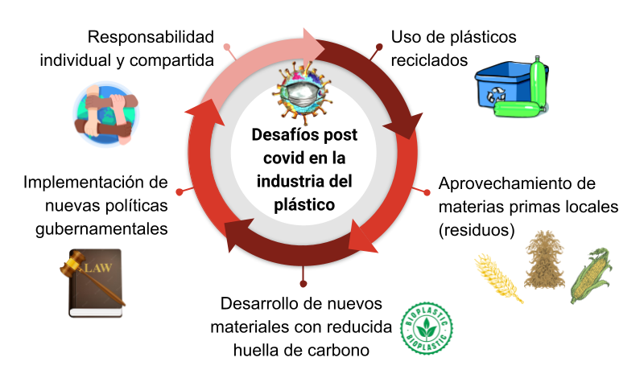

# Influencia de la volatilidad de los precios del petroleo en la produccion Sudamericana de plasticos. 

**Autores**

* Mabel Laz-Mero$^[Departamento de Procesos Químicos, Alimentos y Biotecnología, Facultad de Ciencias Matemáticas, Físicas y Químicas, Universidad Técnica de Manabí, Ecuador.maria.riera@utm.edu.ec; mariaantonietariera@gmail.com
https://orcid.org/0000-0002-7195-2821]
* Miguel Alejandro Tuárez-Párraga$^[Departamento de Diseño e Ingeniería en Empaques, La Fabril S.A., Ecuador
], 
* María Antonieta Riera$^[Departamento de Procesos Químicos, Alimentos y Biotecnología, Facultad de Ciencias Matemáticas, Físicas y Químicas, Universidad Técnica de Manabí, Ecuador.]

## Productores de petróleo en Suramérica

La industria petrolera es una de las más potentes de la economía mundial. Cada año se producen más de 4.000 millones de toneladas (Tn) de este oro negro [@mateo2015; @statista2022a]. La importancia del petróleo no se debe sólo a que es la principal fuente de energía de los países, sino a la cantidad de productos derivados que sirven como materias primas en industrias complementarias [@salas1973].

De acuerdo con información estadística de textcite [@datosmacro;@datosmacro1;@datosmacro2;@statista2022b], los países líderes de la producción de petróleo en Sudamérica son: Brasil, Colombia, Venezuela, Ecuador y Argentina (Figura 1). Durante la pandemia COVID-19, Brasil fue el único país de la región que incrementó su producción, pasando de 2,8 millones de barriles diarios (b/d) de petróleo en el 2019 a 2,9 millones de b/d de petróleo en el 2020, sosteniendo su producción durante el año siguiente. A continuación, se encuentran Colombia, Venezuela, Ecuador y Argentina, con producciones que van desde 473 mil b/d hasta 886 mil b/d de petróleo y que además, disminuyeron su producción petrolera durante la pandemia. Bolivia, Perú y Chile, registran producciones que bordean los 53 mil b/d de petróleo, y por último, están Uruguay y Paraguay, quienes carecen de reservas hidrocarburíferas y están obligadas a importar todo el petróleo y el gas que consumen.

![**Figura 1**. Ranking de los países con mayor producción de petróleo en América del Sur durante los años 2019 a 2021. Elaborado con información tomada de [@datosmacro; @statista2022b].](images/Cap_10_1.png){width=8cm, height=10cm}

Los complejos petroquímicos en Sudamérica están concentrados en Brasil, Venezuela, Argentina; y en menor escala en Colombia y Chile. El principal productor es Brasil con un 30 % de la capacidad de producción en la región, seguidos por Venezuela con el 10%, Argentina con el 8 %, Chile con el 5 % y por último Colombia con el 2% [@brenner; @ortuno2021].

### Brasil

Conforme a lo referido por la Administración de Información Energética (EIA) de EEUU, más del 90% de la producción de petróleo de Brasil se extrae de campos petroleros de aguas profundas en alta mar. Además, estima que a partir de enero de 2021, Brasil dispone de 12.700 millones de barriles de reservas probadas de petróleo, las segundas más grandes de América del Sur después de Venezuela [@USEI; @looney2020].

La industria petroquímica brasileña se ha desarrollado en torno a grandes centros productivos estatales que surgieron en São Paulo, Bahía y Rio Grande do Sul en las décadas de 1970 y 1980 [@dosSantos2022a]. Existe una importante concentración de empresas en los estados que albergan estos grandes complejos petroquímicos, lo que ha permitido el desarrollo de una infraestructura adecuada y la consolidación de una cadena productiva integrada.

Por otra parte, destacan los complejos petroquímicos de Camaçari, en Bahía, que cuenta con uno de los parques petroquímicos más importantes de América Latina, donde se generan hasta 76 diferentes tipos de productos petroquímicos, entre los que destacan las resinas termoplásticas, las fibras sintéticas, los cauchos sintéticos, las resinas y los pigmentos [@sacks2012]. Asimismo, el Complejo Industrial y Portuario de Suape, en Pernambuco, que cuenta con unidades petroquímicas de segunda generación, productoras de Polietileno (PE), policloruro de vinilo (PVC) y propileno  [@viana2021].

Dentro de las industrias petroquímicas, la principal es Braskem, creada en agosto de 2002 por la integración de seis empresas de la Organización Odebrecht y del Grupo Mariani; siendo hoy la mayor productora de resinas termoplásticas de América y la mayor productora de PP en los Estados Unidos. Su producción está centrada en las resinas PE, PP y PVC. Además, el gran portafolio en el mercado incluye el PE verde, fabricado a base de caña de azúcar, siendo un material biobasado [@Braskem2023].

### Venezuela

Venezuela, cuenta con tres complejos petroquímicos: Complejo Petroquímico José Antonio Anzoátegui, situada entre las poblaciones de Píritu y Barcelona, donde se producen fertilizantes nitrogenados y fosfatados, olefinas y plásticos [@vega2016]. Complejo Petroquímico Ana María Campos (El Tablazo), localizado en el Tablazo, a orillas de la costa oriental del Lago de Maracaibo del estado Zulia, donde se obtiene PP, resina termoplástica, homopolímeros, copolímeros, poliestireno de alto impacto y poliestireno cristal [@cepal1966]. El Complejo Petroquímico Morón, ubicado en las costas de Morón, estado Carabobo, se encarga de la producción de cloro, soda caústica, ácido sulfúrico y fertilizantes [@spooner2020].

Actualmente, a pesar de tener una industria petroquímica con varias décadas de funcionamiento y disponer de enormes reservas de petróleo, la industria petrolera está sumergida en una gran crisis. Esto ha traído como consecuencia un gran déficit de energía en el país, además de escasez de materias primas para continuar desarrollando su industria petroquímica [@mercado2000; @flores2023, @DW].

### Argentina

En Argentina, se encuentra el Complejo Petroquímico de Bahía Blanca en el que a partir de gas natural y condensados se produce amoníaco, urea, etileno, propileno y  polietileno de alta densidad (PEAD), polietileno de baja densidad (PEBD), polietileno lineal de baja densidad (PELBD) y PP [@muller2009]. En el complejo de San Lorenzo las materias primas son productos intermedios de refinería y gas natural, usados para la obtención de etileno, PE y PP [@arecco2020]. En Luján de Cuyo, La Ensenada y Dock Sud se producen propileno y PP a partir de gas natural e Hidrocarburos Refinados, también existen los Complejos de Plaza Huincul, Rio III y Campana / Zárate [@deDicco2014].

### Colombia

El desarrollo de la industria petroquímica de Colombia comenzó a principios de la década del 60 con la producción de amoníaco, urea, fertilizantes y carbón. Posteriormente, se produjeron algunas materias primas para la industria de plásticos, tales como el PVC, poliestirenos de propósito general y de alto impacto, el anhídrido ftálico y los plastificantes. Actualmente, posee el complejo refinero petroquímico de Barranca Bermeja, donde se produce PEBD y PVC [@barbosa2007].

### Chile

Chile posee una industria petroquímica muy pequeña alrededor de la refinería Bio Bio en Concepción que produce etileno y Valparaíso, donde se obtiene PP a partir de corrientes de refinería. Adicionalmente, están sus pequeñas reservas de gas natural al sur de Magallanes, construyendo un polo petroquímico en Punta Arenas para la producción de metano a cargo de la empresa Methanex [@campodonico2004].

### Otros países de la región

En cuanto a países como Ecuador, Perú, Bolivia, Uruguay y Paraguay, el panorama petroquímico es bastante deficitario, debido a que no existen polos petroquímicos, lo que obliga a importar derivados para abastecer su mercado interno [@tuarezparraga2022]. A pesar de todo el desarrollo económico y la generación de ingresos que aporta la industria petrolera, esta tiene importantes repercusiones en el medio ambiente, poniendo en peligro la salud humana y el equilibrio ecológico. Las aguas residuales generadas por esta industria, contienen grandes cantidades de hidrocarburos, metales pesados, fenoles y otros productos químicos tóxicos [@thakur2018; @varjani2017], las cuales afectan las aguas superficiales y subterráneas, la producción agrícola y la vida acuática [@zafra2015]. Esta industria también es responsable de contaminación en el suelo por derrame de crudos, pasivos ambientales por actividades de exploración  y explotación petrolera, emisiones de gases de efecto invernadero (GEI), en particular de $CO_{2}$, que contribuyen a agravar los efectos del cambio climático como olas de calor, sequías, inundaciones, crisis alimentarias, entre otros daños ambientales, humanos, sociales y económicos [@sueyoshi2014].

## Comportamiento de precios de barril de petróleo

La pandemia ocasionada por el virus respiratorio COVID-19, paralizó prácticamente las cadenas de suministro del mundo. Esto sucedió debido a que muchos países endurecieron las restricciones de circulación para frenar la propagación del virus [@jomthanachai2022]. Ante la incertidumbre en los negocios y las trabas interpuestas por varios países se ralentizó el comercio internacional [@cepal2020], trayendo como consecuencia la disminución progresiva del consumo de bienes y servicios. En diciembre de 2019 cuando se declararon los primeros casos de COVID-19 en China, el precio del barril de petróleo comenzó a bajar progresivamente y cuando se declaró la pandemia, el petróleo descendió a 16,55 USD / barril (Figura 2).

![**Figura 2**. Precios de barril de petróleo (WTI), durante los años 2019 a 2021. Elaborado con información tomada de [@datosmacropreciosWTI].](images/Cap_10_2.png){width=8cm, height=10cm}

Posteriormente, el precio del barril de petróleo se incrementó paulatinamente hasta llegar al primer año de pandemia con 62,33 USD/barril. Esta situación de aumentos y disminuciones de precios no sólo afecta la producción de energía sino otras industrias, ya que el petróleo sirve como materia prima para la industria petroquímica [@sequera1997], a partir de la cual se obtienen olefinas tales como etileno y propileno (Figura 3). Una olefina es un gas oleofianta o gas formador de aceite [@traniPineda2010]. Principalmente los monómeros de etileno y propileno, se utilizan en las industrias petroquímicas para obtener poliolefinas y mediante procesos de polimerización se pueden producir plásticos como el PE y PP [@gnauck1992]. 

![**Figura 3**. Principales derivados petroquímicos para fabricación de Plástico. Elaborado con información tomada de [@gnauck1992].](images/Cap_10_3.png){width=12cm, height=7cm}

Según Plastics Europe [-@plasticseurope2022] en el año 2021, la industria del plástico tuvo una producción de 390,7 millones de toneladas, siendo la familia de los polietilenos quien tuvo mayor proporción con 26,9%; seguido por la familia de los polipropilenos con 19,3 %. Los precios de estas olefinas (etileno y propileno) por ser derivados directos del petróleo, también fueron afectados durante el COVID-19. Tal como se muestra en la Figura 4, los precios decrecieron en el año 2020 cuando se declaró el inicio de la pandemia.

![**Figura 4**. Precios por tonelada de monómeros de etileno y propileno durante los años 2019 a 2021. Elaborado con información tomada de [@etileno; @propileno].](images/Cap_10_4.png){width=8cm, height=10cm}

Las producción de resinas de PP y PE decrecieron a medida que fueron incrementando los casos confirmados de contagios, lo cual fue ligado a la incertidumbre de compra-venta. Por consiguiente, los precios de estos polímeros disminuyeron su valor hasta alcanzar sus precios mínimo en el mes de marzo con 832,11 USD/Tn y 937 USD/Tn respectivamente, para cada material (Figura 5).

![**Figura 5**. Precios por tonelada de polímeros de polietileno y polipropileno durante los años 2019 a 2021. Elaborado con información tomada de [@tradingeconomics].](images/Cap_10_5.png){width=8cm, height=10cm}

Pese al descenso de los precios en las materias primas utilizadas en la fabricación de plástico, es importante destacar que la aplicación de normas más flexibles en los aforos de lugares públicos y privados, así como la implementación de planes de salud para fomentar la seguridad frente a los contagios, enfatizó el uso de mascarillas y plásticos de un solo uso, haciendo que creciera en gran medida su demanda [@marzoli2021; @riofrio2020; @parashar2021]. Al respecto Abhilash & Inamdar [@ABHILASH2022155895], señalan que los plásticos tomaron un papel importante en la vida cotidiana de las personas, haciendo que los precios por tonelada se incrementaran paulatinamente hasta llegar a 1251,84 USD/Tn de PE y 1312,30 USD/Tn de PP en el primer año de pandemia, siendo precios similares a los registrados en pre-pandemia.

La demanda de este tipo de materiales es impulsada por distintos factores. La misma se ve influenciada por el requerimiento que haya en el mundo de bienes finales fabricados en plásticos, la estacionalidad, contracción económica, restricciones al uso del plástico y finalmente por la relación de precios versus otras resinas que pueden llegar a ser sustitutas. Por otra parte, la oferta depende de la continuidad operativa de las petroquímicas, las mejoras tecnológicas para incrementar la producción, mantenimientos de plantas, reglamentaciones y escasez de materias primas [@esenttia2022]. De tal manera que a lo largo de los años, el PP ha ganado popularidad en todas las esferas del uso diario y aplicaciones específicas, combinando peso ligero, excelente resistencia química, rigidez alta y buena competitividad en costos, convirtiéndola en la opción preferida al momento de seleccionar un material [@Tuarezparragamiguel].

Sin embargo, la pandemia COVID –19 destruyó la demanda a corto plazo en algunas aplicaciones de resina de PP. Con el cambio en el comportamiento del consumidor, junto con las consecuencias económicas, el moldeo por inyección enfrenta vientos en contra; mientras que otras aplicaciones, como la fibra y las películas, florecieron debido al aumento drástico de la demanda de máscaras faciales y dispositivos médicos portátiles [@Casco_2020]. En los tiempos de crisis e incertidumbre, la tendencia general es posponer las compras y el consumo de productos o servicios no esenciales, buscando no hacer compras de alto precio [@sheth2020a]. Es por ello que se ha destacado la importancia de la frugalidad y la necesidad asociada de entender a este tipo de consumidores [@sheth2020b].

Aras et al. [-@araz2020] señalan que el COVID – 19 se ha convertido en una de las perturbaciones más importantes de las últimas décadas. Esta grave crisis hizo que el producto global de la economía en el año 2020, registrara su mayor contracción desde la Segunda Guerra Mundial, provocando cierre de industrias, paralización de la producción de las fábricas y la perturbación de las cadenas de suministro mundial [@golan2020; @bancomundial2020]. Tal situación afectó instantáneamente a las exportaciones de las empresas chinas y redujo drásticamente la disponibilidad de suministros en las cadenas de abastecimiento a nivel mundial [@ivanov2020]. China, que es el taller del mundo, estuvo en pausa para suministrar piezas y componentes industriales. Japón, Corea e India detuvieron las empresas en sus sectores de tecnologías de la información y la comunicación [@vidya2020].

La Organización Mundial del Comercio (OMC), declaró que muchas empresas no tenían un plan para hacer frente a la interrupción de la cadena de suministro y continuar con el abastecimiento de insumos importantes, como alimentos, oxígeno de uso medicinal, mascarillas, desinfectantes y equipos de protección individual [@singh2021]. Las altas tasas de inflación y la falta de materias primas, se reflejó en el incremento en los precios de los productos, desabastecimiento por incumplimiento en plazos de entrega de productos, muchas veces por la escasez en materias primas que impedían la culminación de productos en proceso [@dosSantos2022b].

Da Silva [-@daSilva2021], precisa que la pandemia COVID – 19 mostró debilidades de las cadenas de suministro, la falta de capacidad de reacción ante el fenómeno de la interrupción repentina. Según Zhang et al. [-@zhang2021] las empresas petroleras deben tener en cuenta las posibles soluciones proporcionadas por los modelos de optimización de la gestión de la CS, ya que estos modelos pueden contribuir en resolver diferentes retos a los que se enfrenta esta industria [@abdussalam2021; @deSousa2022]. 

La pandemia ha desvelado la vulnerabilidad y los riesgos de las cadenas mundiales de suministro, al perturbar los nodos nacionales y las redes internas de abastecimiento [@golan2020]. Desde una perspectiva logística, reiniciar la máquina de fabricación después del confinamiento resultó ser difícil. Debido a que el complejo sistema que mueve materias primas y productos terminados en todo el mundo requiere previsibilidad y precisión, ambos perdidos por el cese repentino. El envío para ciertas rutas se disparó, se desarrolló una congestión en los puertos internacionales que luego se extendió a los ferrocarriles y las terminales ferroviarias del interior, exasperando la escasez de camiones y chasis que ya existía [@del2023impacto].

La pandemia ejerció presión sobre la capacidad productiva de las empresas, lo que evidencia aún más la fluctuación de la oferta y la demanda de materiales en el mercado [@daSilva2021]. La afectación de la cadena de suministro está relacionada con las nuevas tendencias de los consumidores, que han repercutido gravemente en todo el mundo [@rajak2022]. Además de la falta de materias primas, la necesidad de aislamiento social y la de muertes en todo el mundo, se tradujo en una gran inflación, algo común para América del Sur, pero a la que EE.UU, Europa y gran parte de Asia no estaban acostumbrados [@dosSantos2022b].

Para hacer frente a los problemas futuros de la CS, las empresas preveen el aumento de las existencias de seguridad y la integración de los almacenes [@singh2021; @zhu2020]. Adicionalmente, es importante contar con el desarrollo y abastecimiento local de materias primas, que no dependan de los precios internacionales del petróleo o de los contratiempos con retrasos en entregas de mercaderías, sino que se puedan aprovechar de manera sostenible. Como lo menciona la CEPAL [-@cepal2022], existen carbohidratos que disponen las plantas verdes que pueden ser utilizados como combustibles generando energía térmica, fermentados para producir olefinas (etano y metano) o usarlos para la producción de alcoholes como etanol o metanol. 

## Transición a materias primas sostenibles**

La pandemia COVID – 19 afectó no sólo al sector salud, sino a toda la sociedad. De esta realidad no escapan los procesos de producción, los cuales se alteraron significativamente, cambiando su dinámica y prioridades. Los requerimientos del mercado en cuanto a medicinas, insumos hospitalarios, ropa de protección, productos de limpieza y de salubridad en general, hicieron que se produjera de manera desmedida algunos materiales sin considerar el deterioro ambiental.

La industria de los plásticos reportó una producción de 368 Millones de toneladas (Mmt) para el año 2020, lo que representa un aumento del 2,51% en relación al 2018 y del 0,27% respecto al 2019 [@statista]. El segmento con mayor participación fue el de empaques con un 40,50% de la producción total; elaborados principalmente con polietileno de alta densidad (PEAD), PEBD, PP y tereftalato de polietileno (PET) [@plasticseurope].

Estos materiales aunque han facilitado la vida, son una gran amenaza para los ecosistemas naturales y la salud humana, dada la gran cantidad de desechos que se generan (incluidos micro y nano plásticos), con prolongados tiempos de degradación y en la mayoría de los casos con disposición inadecuada. La pandemia del COVID-19 agravó esta situación con el uso excesivo y consumo de plásticos de un solo uso, incluidos equipos de protección personal como mascarillas y guantes [@PATRICIOSILVA2021126683].

Por otra parte, la pandemia produjo cambios en el comportamiento de los consumidores, tanto en sus patrones de compra como en la cantidad de residuos producidos [@LEALFILHO2021148571]. Así mismo, el confinamiento contribuyó a la dependencia de las compras en línea y a los servicios de entrega a domicilio, aumentando la demanda de bolsas y envases plásticos de un solo uso [@SHARMA2020105052].

Esta situación plantea un desafío importante, pero también abre una oportunidad para abordar la problemática a través de la circularidad, pasando de los plásticos petrobasados a alternativas bajas en carbono y materiales de base biológica de origen sostenible [@de2022plastic; @GALANAKIS]. La transición hacia materiales ecológicos como los bioplásticos y la adopción de nuevas tecnologías sostenibles serían cruciales para combatir futuras pandemias [@VANAPALLI2021141514]. El uso de bioplásticos biodegradables como material de embalaje junto con mascarillas ecológicas, puede contribuir con la reducción de residuos y por ende minimizar los efectos de la contaminación [@HASIJA2022107894].

Los bioplásticos, son plásticos biobasados, biodegradables o con ambas características, entre los cuales se encuentran el almidón termoplástico, el ácido poliláctico y los polihidroxialcanoatos. Dependiendo de su formulación, es posible alcanzar en algunos casos propiedades similares a los plásticos convencionales. Estos materiales pueden obtenerse dentro de un marco de economía circular y sostenibilidad, usando para tal fin materias primas de origen local, como los residuos orgánicos de diversas fuentes (agricultura, ganadería, actividades domésticas, forestales, etc.).

Sudamérica genera grandes cantidades de residuos lignocelulósicos provenientes de una actividad agrícola extensa, que busca satisfacer las necesidades de alimentación de una población en crecimiento. La disposición inadecuada de estos residuos puede traer problemas ambientales y su biotransformación en productos valiosos, es una alternativa atractiva. Estudios previos han estimado que para el año 2025, se pueden generar alrededor de 900 Mmt de biomasa proveniente del bagazo de la caña de azúcar, la paja de cereales y el banano; lo cual es posible aprovechar para producir más de 550 Mmt de azúcares fermentables [@Magalhaes], útiles en la producción de biomateriales tales como los bioplásticos.

Según datos oficiales y estimaciones de la FAO, Sudamérica registró entre los años 2019 y 2021 una producción cercana a las 1400 Mmt de cultivos primarios, entre los cuales destacan el arroz, el banano, la caña de azúcar, el maíz, la palma aceitera, el plátano, la soja, el sorgo, el trigo y la yuca (Figura 6). Aunque todos los países de la región sudamericana registran en mayor o menor medida actividad agrícola, resalta Brasil con mayor producción agrícola, seguido con gran diferencia por Argentina y Colombia Figura 7 [@faostat].

![**Figura 6**. Cultivos principales producidos en Sudamérica. Elaborado con información tomada de [@faostat].](images/Cap_10_6.png){width=8cm, height=10cm}

![**Figura 7**. Distribución agrícola de cultivos principales en Sudamérica. Elaborado con información tomada de [@faostat].](images/Cap_10_7.png){width=10cm, height=12cm}

Todos estos productores de commodities agrícolas, también son generadores de este tipo de residuo, que pueden ser potencialmente utilizado como fuente para la obtención de biopolímeros. Estos materiales se fabrican a partir de polisacáridos, principalmente a base de almidón, proteínas y otras fuentes alternativas de carbono, como algas o incluso subproductos del tratamiento de aguas residuales. En este contexto, entre los residuos agrícolas más adecuados para ser considerados materia prima en la producción de biopolímeros debido a su alta composición en celulosa, están la paja de soja, hojas y bagazo de caña de azúcar, cascarilla y rastrojo de maíz [@Araujo; @Coppola].

Desde un punto de vista de sostenibilidad, el uso de residuos agrícolas puede reducir la huella de carbono causada en los procesos de producción. Estudios recientes muestran que las emisiones de gases de efecto invernadero (GEI), para producir bioplásticos, oscilan entre 0,354 y 0,623 kg CO2 equivalente por kg de bioplástico, en comparación con 2,37 kg CO2 equivalente por kg de PP como petroplástico. De tal modo, los bioplásticos producidos a partir de desechos agrícolas se pueden fabricar a escala industrial para reducir los daños causados por la dependencia de los plásticos derivados del petróleo [@Samer2022].

Por otra parte la crisis causada por la COVID-19, ha puesto de manifiesto la necesidad de desarrollar una economía circular basada en el paradigma de acortar los canales de distribución, utilizar materias primas locales, limitar el consumo de materias primas, recursos como energía, agua, reducir la generación de residuos a lo largo del ciclo de vida de productos, bajo la concepción de desarrollo de productos bajos en carbono [@en14154705].

Ahora bien, el éxito en el desarrollo de estos biomateriales, requiere el análisis de la cadena de valor de la biomasa, la cual comprende actividades económicas secuenciales e interdependientes que incluyen el uso de la tierra y la producción de materia prima, la conversión a portadores de base biológica y los mercados que utilicen los productos finales. En este sentido, su idoneidad, eficiencia y escalas de implementación apropiadas dependen de las características geográficas y climáticas específicas de cada región [@Panoutsou].

## Desafíos futuros

Sin duda son algunos los desafíos que debe enfrentar la actual industria del plástico, para hacerla más sostenible en una era post pandemia (Figura 8). El COVID-19 expuso las vulnerabilidades de los países productores de materias primas de América Latina, debido a la alta dependencia de las exportaciones de materias primas, la dependencia del financiamiento externo y la volatilidad de los tipos de cambio [@Tobias]. Esta crisis global causó daños considerables a nivel mundial, afectando la disponibilidad y el suministro de una amplia variedad de materias primas, bienes intermedios y productos terminados. La pandemia afectó negativamente a las cadenas de suministros globales en todas sus etapas: adquisición de materias primas, procesamiento, transporte y logística. La nueva normalidad, requiere que las cadenas de suministro sean resilientes, para reducir su vulnerabilidad en tiempos de crisis [@9174793].

{width=10cm, height=10cm}

Uno de los legados que dejó la pandemia del coronavirus es el de revertir la globalización, lo que podría representar un retroceso parcial en la integración productiva a través de las fronteras, que se logró en décadas anteriores [@canuto2020impact]. Esto motiva el uso de materias primas locales, para dar soluciones nacionales a los procesos de producción. Así mismo en la etapa posterior a la COVID-19, ha cobrado gran atención la gestión de la cadena de suministro ecológicamente amigables. Una huella de carbono reducida en la industria del plástico, contempla el uso de recursos plásticos reciclados, la optimización de los procesos, el uso de energías renovables, así como el desarrollo de bioplásticos en reemplazo de los plásticos tradicionales [@su142315858].

La pandemia representa una oportunidad para acelerar la innovación de los países. La investigación respecto al uso de recursos renovables y el desarrollo de nuevos biomateriales a partir de estos, puede conducir seriamente a la adopción de una economía baja en carbono, generando oportunidades en la producción sostenible y el abastecimiento de los bioplásticos [@Coppola].

La transición hacia una bioeconomía circular podría contribuir con la valorización de los recursos. Las cadenas de suministros deben volverse más resilientes para poder adaptarse rápidamente a crisis severas y futuras crisis, mientras que es importante aumentar la circularidad hacia la valorización de los desechos, la integración de diferentes procesos dentro del concepto de biorrefinería y la producción de bioproductos y biocombustibles [@GALANAKIS].

Sin embargo, el escenario post-COVID-19 requiere la implementación de políticas gubernamentales intensificadas para promover el desarrollo de procesos ecológicamente amigables con el ambiente, así como tecnologías que promuevan principios económicos circulares [@UMARAW202010]. Incentivar medidas que fomenten la circularidad y las prácticas sostenibles, y las inversiones público-privadas en investigación, infraestructura y mercadeo ayudarían a lograr estos cambios. La responsabilidad individual, la acción corporativa y la política gubernamental, son una unión necesaria para evitar consecuencias desastrosas a futuro [@VANAPALLI2021141514].

## Referencias {-}

