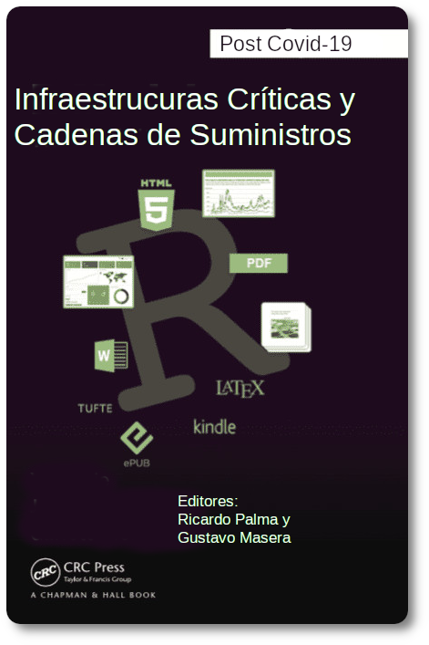

--- 
title: "IC & SCM Post COVID_19"
author: 'Editores: Ricardo R. Palma y Gustavo A. Masera'
date: "2023-01-11"
output: pdf_document
documentclass: book
bibliography:
- book.bib
- packages.bib
url: https://github.com/ricardorpalma/IC_SCM
cover-image: images/cover.png
description: |
  This is a minimal example of using the bookdown package to write a book.
  set in the _output.yml file.
  The HTML output format for this example is bookdown::bs4_book,
biblio-style: apalike
csl: "chicago-fullnote-bibliography.csl"
site: bookdown::bookdown_site
---

# Introducción {-}


Este libro es una compilación de los trabajos de investigación y estancias de investigadores de varios colegas de latino américa y caribe. Guestavo Masera y Ricardo Palma desean agradecer a todos los colaboradores que nos han confiado sus materiales para que los editemos en esta publicación. Como docentes investigadores de la Universidad Nacional de Cuyo hemos vivido este fenómeno singular de tiempo que denominamos la pandemia del post-covid-19 y como los autores de los capítulos incluidos, tenemos la convicción que la existencias de nuevas estrategias emergentes y prácticas innovadoras que mejoras la resiliencia y han demostrado innovación de la gestión de las infraestructuras críticas y las cadenas de suministros.



## Agradecimientos: {-}


Este libro digital ha sido financiado en parte por las siguientes instituciones y por la amable cesión de derechos de publicación de los autores de cada capítulo.
Entre otros nso gustaría agradecer a:


- Programa Imeroamericano de Ciencia y Tecnología para el Desarrollo


y al grupo de trabajo de CyTED 
[link](https://themys.sid.uncu.edu.ar/rpalma/En_Desarrollo/about.html)


- Asociación Grupo Montevideo de Universidades


- Secretaría de Ciencia Técnica y Posgrado de la Universidad Nacional de Cuyo


## Indicaciones para colaboradores

Este libro puede ser intervenido por los lectores.
Para solicitar errores que pudiesen haberse filtrado o incluso para agregar material a los capítulos se dispone de los medios de intervención provistos por Markdown / GitHub
Este breve explicación le permite ver la síntaxis y métodos de agregar contenidos.


This is a _sample_ book written in **Markdown**. You can use anything that Pandoc's Markdown supports; for example, a math equation $a^2 + b^2 = c^2$.

## Usage 

Each **bookdown** chapter is an .Rmd file, and each .Rmd file can contain one (and only one) chapter. A chapter *must* start with a first-level heading: `# A good chapter`, and can contain one (and only one) first-level heading.

Use second-level and higher headings within chapters like: `## A short section` or `### An even shorter section`.

The `index.Rmd` file is required, and is also your first book chapter. It will be the homepage when you render the book.

## Render book

You can render the HTML version of this example book without changing anything:

1. Find the **Build** pane in the RStudio IDE, and

1. Click on **Build Book**, then select your output format, or select "All formats" if you'd like to use multiple formats from the same book source files.

Or build the book from the R console:


```r
bookdown::render_book()
```

To render this example to PDF as a `bookdown::pdf_book`, you'll need to install XeLaTeX. You are recommended to install TinyTeX (which includes XeLaTeX): <https://yihui.org/tinytex/>.

## Preview book

As you work, you may start a local server to live preview this HTML book. This preview will update as you edit the book when you save individual .Rmd files. You can start the server in a work session by using the RStudio add-in "Preview book", or from the R console:


```r
bookdown::serve_book()
```


